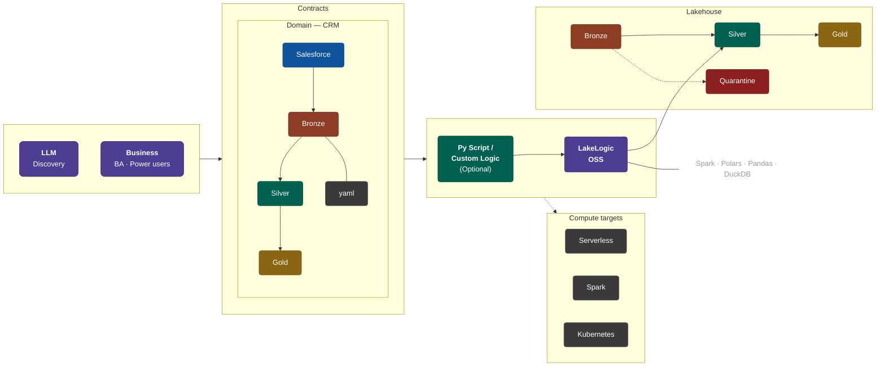

# LakeLogic

**Your data estate. Under Contract.**

[](https://LakeLogic.github.io/LakeLogic/)
[](https://pypi.org/project/lakelogic/)
[](https://www.python.org)
[](LICENSE)

Catch breaking data changes before they reach production. One YAML contract. Any engine.
Every row validated, quarantined, or promoted — automatically.

---

## 🌐 Data Mesh Alignment

LakeLogic is built for the decentralized data estate, directly supporting the four pillars of **Data Mesh**:

- **Domain Ownership**: Contracts are owned and defined by domain teams (e.g., CRM, Finance) who know the data best.
- **Data as a Product**: Contracts serve as the explicit "product interface," guaranteeing quality for consumers.
- **Self-Serve Platform**: A standardized runtime that any team can use to deploy quality gates without infra silos.
- **Federated Governance**: Global standards (e.g., PII masking) are defined centrally but enforced locally at every layer.

---

## 🛑 The Problem: Fragmented Truth

In a traditional data stack, data quality logic is siloed. You define "valid"
in SQL for your warehouse, then rewrite those same rules in Python for your
Spark jobs.

This duplication creates **Logic Drift** — a world where your data standards
differ depending on which engine the code runs on. When your definitions of
"good data" are scattered across tools, trust in your data estate evaporates.

## ✅ The Solution: Define Once. Enforce Everywhere

LakeLogic makes your **Data Contract the Single Source of Truth**.

### `contract.yaml` — this is your entire quality gate
```yaml
# REQUIRED: Contract version for compatibility tracking
version: "1.0"

# REQUIRED: Metadata for domain and system classification
info:
  title: Silver Customers
  owner: data-team
  domain: CRM
  system: Salesforce

# REQUIRED: Schema definition with types and constraints
model:
  fields:
    - name: customer_id
      type: integer
      required: true
    - name: first_name
      type: string
      pii: true  # Business value: Automatic PII detection and masking
    - name: last_name
      type: string
      pii: true
    - name: email
      type: string
      pii: true
    - name: revenue
      type: float
    - name: status
      type: string

# REQUIRED: Data acquisition pattern and location
source:
  type: landing
  path: "data/customers/*.csv"  # Supports: Files (S3/ADLS) or DB Tables (e.g., Unity Catalog)
  load_mode: incremental

# OPTIONAL EXAMPLE: Data cleaning, enrichment, and deduplication logic
transformations:
  - rename:
      from: "cust_id"
      to: "customer_id"
    phase: "pre"  # PRE: Applied before schema validation (fixes source naming drift)
  - deduplicate:
      columns: ["customer_id"]
      order_by: "updated_at"
  - sql: |
      SELECT 
        *,
        UPPER(status) as status_code,
        revenue * 0.1 as tax_estimate
      FROM source
    phase: "post" # POST: Applied after validation (complex logic and enrichment)

# OPTIONAL EXAMPLE: Validation rules (row-level and dataset-level)
quality:
  row_rules:
    - sql: "customer_id IS NOT NULL AND email IS NOT NULL"
    - sql: "status IN ('active', 'churned', 'pending')"
    - sql: "revenue >= 0"
    - sql: "email LIKE '%@%.%'"
  dataset_rules:
    - unique: "customer_id"

# OPTIONAL EXAMPLE: Data provenance and audit injection
lineage:
  enabled: true

# REQUIRED: Output storage and write strategy
materialization:
  strategy: merge
  target_path: "silver/customers"  # Supports: File paths or DB Tables (e.g., Unity Catalog)
  format: delta
  merge_keys: [customer_id]

# OPTIONAL EXAMPLE: Isolation for failed records
quarantine:
  enabled: true
  target: "quarantine/customers"
```

> [!TIP]
> **[View the Complete Contract Reference](docs/contract_template.md)** for a deep-dive into every available configuration option.

### Run it anywhere

```python
from lakelogic import DataProcessor

# Same contract runs on Polars, Spark, DuckDB, or Pandas
result = DataProcessor("contract.yaml").run_source()

print(f"✅ Valid: {result.good_count}  |  ❌ Quarantined: {result.bad_count}")
```

---

## 🏗️ Visual Overview: Medallion with Quality Gates

LakeLogic enforces your Data Contracts as programmable quality gates across the entire lifecycle of your data.



---

## Business Impact: Trust, Speed, and ROI

### 💰 Cut Compute Spend by 80%
Not every job needs a massive Spark cluster. Use LakeLogic's **Engine Agnostic** runtime to process maintenance tasks and small-to-medium datasets on high-performance local engines like **Polars** or **DuckDB**.

### 🛡️ Guaranteed Data Integrity
Mathematically provable data quality. LakeLogic detours "dirty" data into a **Safe Quarantine** zone with absolute precision, ensuring downstream dashboards are never poisoned.

### 🔍 Full Pipeline Transparency
Eliminate the "Black Box." LakeLogic provides full lineage injection, allowing you to trace any board-level KPI back to the raw source records and the specific contract that validated them.


## Quick Start (60 Seconds)

```bash
pip install "lakelogic[all]"
```

### 1. Bootstrap a contract
```bash
lakelogic bootstrap --landing data/ --output contracts/ --ai
```
*(Scans data, infers schemas, detects PII, and generates rules using AI)*

### 2. Run the quality gate
```bash
lakelogic run --contract contracts/customers.yaml --source data/customers.csv
```

---

## Core Documentation Assets

| Asset | Description |
| :--- | :--- |
| 🏗️ **[Governance at Scale](docs/organization.md)** | How to organize 1,000s of contracts for enterprise data estates. |
| 📜 **[Complete Contract Template](docs/contract_template.md)** | Deep-dive into every configuration option and business use case. |
| 🧩 **[Medallion Architecture](docs/architecture_diagram.md)** | Visual guide to Quality Gates across Bronze, Silver, and Gold layers. |
| 🚀 **[Full Documentation](https://LakeLogic.github.io/LakeLogic)** | Guides, API reference, and deployment patterns. |

---

## Technical Capabilities

- **Engine Agnostic**: Auto-optimizes for Spark, Polars, DuckDB, or Pandas.
- **Incremental-First**: Built-in watermarking, CDC, and file-mtime tracking.
- **SQL-First Rules**: Define business logic in the language your team already speaks.
- **Automatic Lineage**: Every row stamped with Run IDs and source paths.
- **100% Reconciliation**: Mathematically guaranteed: `source = good + bad`.

---

## 🚀 Examples

The [examples](https://github.com/LakeLogic/LakeLogic/tree/main/examples) directory contains runnable notebooks across three learning tracks:

| Folder | What You'll Learn |
|:---|:---|
| [`01_quickstart/`](examples/01_quickstart/) | Remote CSV ingestion, database governance, dbt + PII quality |
| [`02_core_patterns/`](examples/02_core_patterns/) | Bronze quality gate, medallion architecture, SCD2, deduplication, reference joins, soft deletes |
| [`03_compliance_governance/`](examples/03_compliance_governance/) | HIPAA & GDPR Policy Packs, automated PII masking, audit-ready quarantine |

## 📖 Documentation

- **[Full Docs](https://LakeLogic.github.io/LakeLogic)** — Complete guides and API reference
- **[Quickstart](https://LakeLogic.github.io/LakeLogic/quickstart/)** — Get running in 5 minutes
- **[Contract Reference](docs/contract_template.md)** — Full YAML field reference
- **[Changelog](https://github.com/LakeLogic/LakeLogic/blob/main/CHANGELOG.md)** — Release history and breaking changes
- **[CLI Reference](https://LakeLogic.github.io/LakeLogic/cli/)** — Command-line usage

## 🤝 Contributing

See `CONTRIBUTING.md` to get started, or `docs/installation.md#developer-installation` for environment setup.

---

### 📄 License

Apache-2.0
