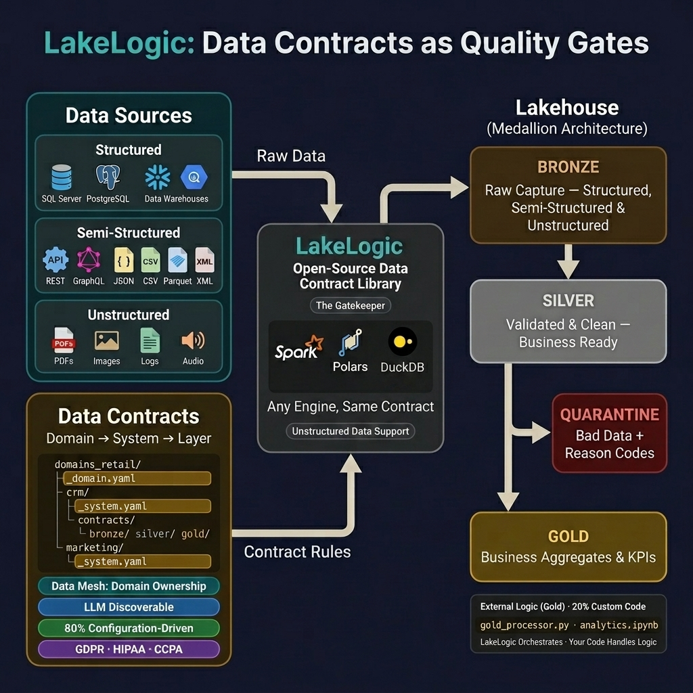

# LakeLogic Architecture: Medallion with Quality Gates

This diagram illustrates how LakeLogic enforces data contracts as **quality gates** across the medallion architecture (Bronze → Silver → Gold).

## High-Level Lifecycle


---

## Detailed Medallion Flow

### 🟤 BRONZE LAYER: Raw Capture

**Goal**: 100% preservation of source data with zero silent drops.

```text
+----------------------------------------------------------+
|            "Capture Everything Raw (No Validation)"       |
+----------------------------------------------------------+
|                                                           |
|  [Contract] bronze_contract.yaml                          |
|  +----------------------------------------------------+  |
|  | # No quality rules in Bronze                       |  |
|  | # Goal is 100% capture of source data              |  |
|  +----------------------------------------------------+  |
|                                                           |
|  Strategy: overwrite or append                            |
|  Output:   bronze_customers.parquet                       |
+----------------------------+------------------------------+
                             |
                             v
+----------------------------+    +--------------------------+
| QUALITY GATE:              |    | QUARANTINE ZONE          |
| Bronze -> Silver           |    +--------------------------+
|                            |    | quarantine/              |
| [1] Pre-Processing         |    |   bronze_bad.parquet     |
|   - rename columns         |    |                          |
|   - filter invalid rows    |    | Error Reasons:           |
|   - deduplicate            |    |   - email_format         |
|   - trim, lower, cast      |    |   - age_positive         |
|                            |    |   - missing_id           |
| [2] Schema Enforcement     |    |                          |
|   - Type validation        |    | Correction Loop:         |
|   - Required fields        |    |   1. Fix source data     |
|   - Unknown field policy   |    |   2. Reprocess           |
|                            |    |   3. Flow to Silver      |
| [3] Quality Rules          |    +--------------------------+
|   - Row: not_null, regex   |
|   - Dataset: unique        |
|                            |
| [4] Post-Processing        |
|   - derive fields          |
|   - lookup/join dims       |
+----------------------------+
```

### ⚪ SILVER LAYER: Business Validation
**Goal**: Trusted, cleaned, and queryable data for bulk analytics.

```text
+----------------------------------------------------------+
|          "Validated, Cleaned, Business-Ready"             |
+----------------------------------------------------------+
|                                                           |
|  [Contract] silver_contract.yaml                          |
|  +----------------------------------------------------+  |
|  | transformations:                                    |  |
|  |   - deduplicate:                                    |  |
|  |       on: ["customer_id"]                           |  |
|  |                                                      |  |
|  | quality:                                             |  |
|  |   row_rules:             # Full validation          |  |
|  |     - not_null: email                               |  |
|  |     - regex_match:                                  |  |
|  |         field: email                                |  |
|  |         pattern: "^[^@]+@[^@]+\\.[^@]+$"            |  |
|  +----------------------------------------------------+  |
|                                                           |
|  Output: silver_customers.parquet / Delta / Iceberg       |
+--------+--------------------------------------+----------+
         |                                      |
         | PASSED                                | FAILED
         |                                      |
         v                                      v
+----------------------------+    +--------------------------+
| QUALITY GATE:              |    | QUARANTINE ZONE          |
| Silver -> Gold             |    +--------------------------+
|                            |    | quarantine/              |
| Contract Enforcement:      |    |   silver_bad.parquet     |
|   - Schema validation      |    |                          |
|   - Business rules         |    | Reason codes logged      |
|   - Referential integrity  |    +--------------------------+
|   - Statistical checks     |
+----------------------------+
```

### 🟡 GOLD LAYER: Aggregated & Enrich

**Goal**: Business-ready aggregations, KPIs, and analytics datasets.

```text
+----------------------------------------------------------+
|     "Aggregated, Business KPIs, Analytics-Ready"          |
+----------------------------------------------------------+
|                                                           |
|  [Contract] gold_contract.yaml                            |
|  +----------------------------------------------------+  |
|  | # OPTION 1: SQL-Based Aggregation                  |  |
|  | transformations:                                    |  |
|  |   - sql: |                                          |  |
|  |       SELECT                                        |  |
|  |         customer_segment,                           |  |
|  |         DATE_TRUNC('month', sale_date) AS month,    |  |
|  |         SUM(revenue) AS total_revenue,              |  |
|  |         COUNT(DISTINCT customer_id) AS customers    |  |
|  |       FROM silver_sales                             |  |
|  |       GROUP BY customer_segment, month              |  |
|  |     phase: post                                     |  |
|  |                                                      |  |
|  | # OPTION 2: External Python Logic                  |  |
|  | external_logic:                                     |  |
|  |   type: python                                      |  |
|  |   path: ./gold/build_sales_gold.py                  |  |
|  |   entrypoint: build_gold                            |  |
|  |   args:                                             |  |
|  |     apply_ml_scoring: true                          |  |
|  |                                                      |  |
|  | # OPTION 3: Jupyter Notebook                        |  |
|  | external_logic:                                     |  |
|  |   type: notebook                                    |  |
|  |   path: ./gold/sales_analytics.ipynb                |  |
|  |   output_path: output/gold_fact_sales.parquet       |  |
|  +----------------------------------------------------+  |
|                                                           |
|  Output: gold_fact_sales.parquet / Delta / Iceberg        |
+----------------------------+------------------------------+
                             |
                             v
              +--------------------------+
              | Business Use             |
              +--------------------------+
              |  - Dashboards            |
              |  - ML Models             |
              |  - APIs                  |
              |  - Data Products         |
              +--------------------------+
```

## External Python Logic Detail

```text
+----------------------------------------------------------+
|     EXTERNAL PYTHON LOGIC FOR GOLD LAYER                  |
|          (Advanced Transformations)                       |
+----------------------------------------------------------+
```

**API Call (Spark-Oriented):**

```python
# Pass a Spark DataFrame to the contract
contract = DataContract("build_sales_gold.yaml")
good_df, bad_df = contract.run(spark_df, engine="spark")
```

**Example Gold Processor:**

```text
Input: silver_sales (Spark DataFrame)
   |
   v
+----------------------------------------------------------+
|  gold/build_sales_gold.py                                 |
+----------------------------------------------------------+
```

```python
from pyspark.sql import functions as F

def build_gold(df, **kwargs):
    """Spark-oriented business logic for Gold"""
    return (
        df
        # Dynamic partitions / ML scoring
        .withColumn("churn_risk", predict_udf("id"))
        .withColumn("amount_tax", F.col("amt") * 1.1)
        .withColumn("month", F.month("sale_date"))

        # Filter out outliers
        .filter("amt > 100")

        # Distributed aggregations
        .groupBy("segment", "month")
        .agg(
            F.sum("amount_tax").alias("total_rev"),
            F.count("id").alias("txn_count")
        )
    )
```

```text
Output: gold_fact_sales.parquet (ML-enriched, aggregated)
```

## Multi-Engine Support

```text
┌──────────────────────────────────────────────────────────┐
│          LAKELOGIC MULTI-ENGINE ARCHITECTURE              │
└──────────────────────────────────────────────────────────┘

Same Contract YAML → Multiple Execution Engines

┌────────────────────────────────────────────────────────┐
│  📋 customer_contract.yaml                             │
│  ┌──────────────────────────────────────────────────┐ │
│  │ version: 1.0.0                                    │ │
│  │ dataset: customers                                │ │
│  │ quality:                                          │ │
│  │   row_rules:                                      │ │
│  │     - name: "email_valid"                         │ │
│  │       sql: "email LIKE '%@%'"                     │ │
│  └──────────────────────────────────────────────────┘ │
└────────────────────────────────────────────────────────┘
                        │
             ┌──────────┴──────────┐
             ▼                     ▼
      ┌──────────────┐      ┌──────────────┐
      │   Polars     │      │    Spark     │
      │   Adapter    │      │   Adapter    │
      ├──────────────┤      ├──────────────┤
      │              │      │              │
      │ • Fast local │      │ • Distributed│
      │ • LazyFrame  │      │ • Delta Lake │
      │ • Rust core  │      │ • Unity Cat  │
      │              │      │              │
      │ Use Case:    │      │ Use Case:    │
      │ Dev/Testing  │      │ Production   │
      └──────────────┘      └──────────────┘

Auto-Discovery Priority:
1. LAKELOGIC_ENGINE env var (manual override)
2. Spark (if in Databricks/Synapse)
3. Polars (preferred for single-node)
```

## Key Architecture Principles

### 1. Separation of Concerns

```text
┌──────────────────────────────────────────────────────────┐
│                  LAYER RESPONSIBILITIES                   │
└──────────────────────────────────────────────────────────┘

🟤 BRONZE: Capture & Preserve
   • No validation (Capture 100% of raw data)
   • No quarantine (No silent drops)
   • Schema evolution: append/merge
   • Goal: Immutable Raw Record

⚪ SILVER: Validate & Standardize (Latest Version)
   • Full schema enforcement
   • Business rule validation
   • Deduplication / SCD Type 1
   • Type casting
   • Goal: Trusted, queryable data

🟡 GOLD: Aggregate & Enrich (Snapshots/SCD2)
   • Business KPIs
   • ML feature engineering
   • Dimension joins (SCD Type 2)
   • Goal: Analytics-ready datasets
```

### 2. 100% Reconciliation Guarantee

```text
Mathematical Guarantee:
source_count = good_count + bad_count

Every input row is accounted for:
• Good rows → Next layer
• Bad rows → Quarantine (with error reasons)
• Nothing is silently dropped
```

### 3. Workflow Patterns

```text
┌──────────────────────────────────────────────────────────┐
│                  COMMON WORKFLOWS                         │
└──────────────────────────────────────────────────────────┘

Pattern 1: Bronze as Strings
─────────────────────────────
Bronze: Cast all columns to string (zero failures)
Silver: Type casting + validation (quarantine bad types)
Gold: Business logic on clean data

Pattern 2: Incremental Loading
───────────────────────────────
source:
  load_mode: incremental
  watermark_field: updated_at

Pattern 3: SCD Type 2 History
──────────────────────────────
materialization:
  strategy: scd2
  scd2:
    primary_key: customer_id
    timestamp_field: updated_at
    start_date_field: valid_from
    end_date_field: valid_to

Pattern 4: External ML Scoring
───────────────────────────────
external_logic:
  type: python
  path: ./ml/score_customers.py
  entrypoint: predict_churn
```

## Environment Override

```text
┌──────────────────────────────────────────────────────────┐
│            ENVIRONMENT-SPECIFIC OVERRIDES                 │
└──────────────────────────────────────────────────────────┘

Contract with environment overrides:

server:
  type: s3
  path: s3://prod-bucket/data/customers
  format: delta

environments:
  dev:
    path: s3://dev-bucket/data/customers
    format: parquet
  staging:
    path: s3://staging-bucket/data/customers
    format: delta
  prod:
    path: s3://prod-bucket/data/customers
    format: delta

Usage:
  export LAKELOGIC_ENV=dev
  python run_pipeline.py
```

## Observability & Lineage

```text
┌──────────────────────────────────────────────────────────┐
│              LINEAGE CAPTURE EXAMPLE                      │
└──────────────────────────────────────────────────────────┘

Input Record:
{
  "customer_id": 123,
  "email": "user@example.com",
  "age": 25
}

After LakeLogic Processing (lineage enabled):
{
  "customer_id": 123,
  "email": "user@example.com",
  "age": 25,
  "_lakelogic_source": "s3://bucket/raw/customers.parquet",
  "_lakelogic_processed_at": "2026-02-09T10:05:33Z",
  "_lakelogic_run_id": "a3b8d1b6-0b3b-4b1a-9c1a-1a2b3c4d5e6f",
  "_lakelogic_domain": "sales",
  "_lakelogic_system": "crm"
}

Quarantine Record (if failed):
{
  "customer_id": 123,
  "email": "invalid-email",
  "age": -5,
  "_lakelogic_errors": [
    "Rule failed: email_format (email LIKE '%@%')",
    "Rule failed: age_positive (age >= 0)"
  ],
  "_lakelogic_categories": ["correctness", "correctness"],
  "quarantine_state": "active",
  "quarantine_reprocessed": false
}
```

## Best Practices

### 1. Contract Organization

```text
contracts/
├── bronze/
│   ├── crm_contacts.yaml
│   ├── web_events.yaml
│   └── payment_transactions.yaml
├── silver/
│   ├── customers.yaml
│   ├── orders.yaml
│   └── products.yaml
└── gold/
    ├── customer_metrics.yaml
    └── revenue_summary.yaml
```

### 2. Quality Rule Categories

Use standard categories for consistency:

- `completeness`: Not null, required fields
- `correctness`: Data type, format, range
- `consistency`: Referential integrity, cross-field validation
- `validity`: Business rule compliance
- `accuracy`: Statistical checks, anomaly detection
- `timeliness`: Freshness, staleness
- `uniqueness`: Duplicate detection
- `integrity`: Foreign key constraints

### 3. Error Handling

```python
from lakelogic import DataProcessor

try:
    proc = DataProcessor(contract="contract.yaml")
    source, good, bad = proc.run_source("data.parquet")
    
    # Check quarantine threshold
    quarantine_ratio = len(bad) / (len(good) + len(bad))
    if quarantine_ratio > 0.10:  # 10% threshold
        raise ValueError(
            f"Quarantine ratio {quarantine_ratio:.2%} "
            "exceeds threshold"
        )
    
    proc.materialize(good, bad)
    
except Exception as e:
    notify_team(f"Pipeline failed: {e}")
    raise
```

---

*For more details, see the [LakeLogic Documentation](https://lakelogic.org)*
