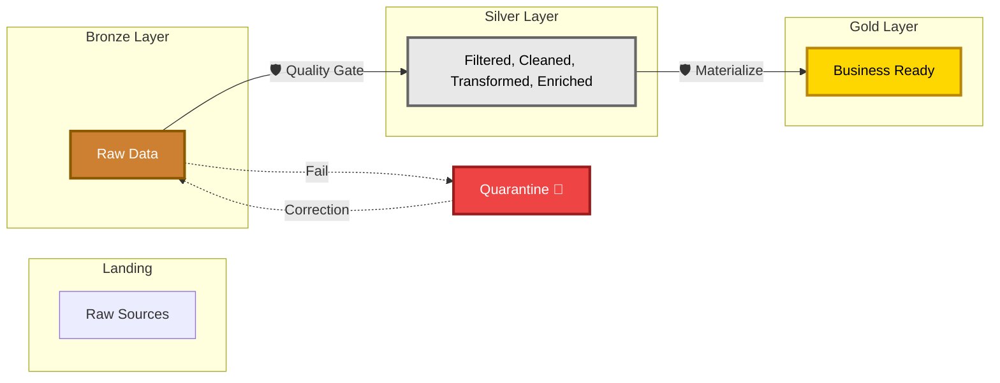

# The Medallion Architecture

LakeGuard is the **quality gate** between the layers of your Data Lakehouse.



## Cleansing Transformations (Bronze → Silver)

In the Bronze layer, data is often "dirty." Before you apply strict quality rules or perform heavy calculations, you need to clean the noise.

LakeGuard processes transformations in a specific order to ensure maximum performance and safety:

### 1. Pre-Processing (Cleanse)
These run **first**, before schema enforcement and quality rules.
-   **`rename`**: Align column names (e.g., `cust_id` to `customer_id`).
-   **`filter`**: Drop invalid rows immediately (e.g., `WHERE status = 'active'`).
-   **`deduplicate`**: Keep the latest version of a record based on a timestamp.

Structured transformations are convenience wrappers for engine-agnostic contracts; SQL steps are preferred for advanced logic.
Common helpers include:
- **`select`**, **`drop`**, **`cast`**
- **`trim`**, **`lower`**, **`upper`**
- **`coalesce`**, **`split`**, **`explode`**
- **`map_values`**
- **`join`** (post-processing)
- **`derive`**, **`lookup`** (post-processing)

### Two Transformation Flavors
You can express transformations in two ways:
- **Structured (business-friendly)**: `rename`, `filter`, `deduplicate`, `select`, `drop`, `cast`, `trim`, `lower`, `upper`, `coalesce`, `split`, `explode`, `map_values`, `join`, `lookup`, `derive`.
- **SQL (power-user)**: full SQL with `phase: pre|post`.

Both flavors can be mixed, but the SQL style is more expressive.

### When to Use Which
- **Structured**: You want readable, intent-first contracts for common patterns.
- **SQL**: You need window functions, complex joins, multi-step logic, or vendor-specific SQL.

You can also provide SQL transformations directly:

```yaml
transformations:
  - sql: |
      SELECT * FROM (
        SELECT *, ROW_NUMBER() OVER (PARTITION BY id ORDER BY updated_at DESC) AS rn
        FROM source
      ) AS t
      WHERE rn = 1
    phase: pre
```

And here is the same idea using structured steps:

```yaml
transformations:
  - deduplicate:
      on: ["id"]
      sort_by: ["updated_at"]
      order: desc
```

### 2. Validation Gate
LakeGuard then enforces your **Schema** and runs your **Quality Rules**. Because you've already filtered and deduplicated, this stage is faster and produces fewer "false alerts."

Common quality helpers:
- Row-level: `not_null`, `accepted_values`, `regex_match`, `range`, `referential_integrity`
- Dataset-level: `unique`, `null_ratio`, `row_count_between`

Example:

```yaml
quality:
  row_rules:
    - not_null: email
    - accepted_values:
        field: status
        values: ["ACTIVE", "INACTIVE"]
    - regex_match:
        field: email
        pattern: "^[^@]+@[^@]+\\.[^@]+$"
    - range:
        field: age
        min: 18
        max: 120
  dataset_rules:
    - unique: customer_id
    - null_ratio:
        field: email
        max: 0.05
    - row_count_between:
        min: 1
        max: 1000000
```

### 3. Post-Processing (Enrich)
These run **last**, only on the "Good" data.
-   **`derive`**: Calculate new fields using SQL (e.g., `price * quantity`).
-   **`lookup`**: Join with dimension tables to add names or categories.

```yaml
transformations:
  - sql: |
      SELECT *, amount * quantity AS revenue
      FROM source
    phase: post
```

---

## Handling Complex Patterns (Gold)

When moving from **Silver to Gold**, LakeGuard doesn't just check rules; it uses a **Strategy** to build your tables.

### 1. The "Orphaned Key" Problem
Sometimes a transaction (Fact) arrives before its customer info (Dimension). This is a **Late Arriving Dimension**.

**The LakeGuard Solution**:
Instead of losing the transaction, we use the `default_value` feature.
-   If `customer_id` is found: Use it.
-   If `customer_id` is missing: Map it to `-1` (Unknown).
-   This ensures **100% data financial integrity**.

### 2. The Correction Loop
If data fails a rule in **Bronze**, it goes to **Quarantine**. 
1.  **Fix**: The data owner fixes the raw source or provides a correction file.
2.  **Reprocess**: LakeGuard picks up the correction and flows it through to **Silver** and **Gold**.

## Materialization Strategies

LakeGuard can materialize validated data to local CSV/Parquet targets or Delta/Iceberg when running on Spark. Use `processor.materialize(...)` or `lakeguard run --materialize`.

```yaml
materialization:
  strategy: merge
  target_path: output/customers
  format: csv
```

| Strategy | When to use it |
| :--- | :--- |
| **`append`** | For giant transaction tables where you just keep adding rows. |
| **`merge`** | For "SCD Type 1" (Updating existing records). |
| **`scd2`** | For "History Tracking" (Keeping old and new versions). |
| **`overwrite`** | For small summary tables or daily snapshots. |

**Spark advantage:** Merge and SCD2 strategies run natively using distributed DataFrame operations (or Delta Lake `MERGE INTO` when available), avoiding driver memory bottlenecks at scale.

---

## External Logic Hooks (Gold Patterns)

For Gold processing, some teams prefer dedicated Python scripts or notebooks.
You can reference them directly in the contract:

```yaml
external_logic:
  type: python
  path: ./gold/build_sales_gold.py
  entrypoint: build_gold
  args:
    target_table: gold_fact_sales
```

Notebook example:

```yaml
external_logic:
  type: notebook
  path: ./gold/sales_gold.ipynb
  output_path: output/gold_fact_sales.parquet
  output_format: parquet
```

If `output_path` is provided, LakeGuard will read it back in for materialization.
Otherwise, set `handles_output: true` if the external logic writes the final table itself.

---

## Intelligent Engine Selection (Portable Logic)

LakeGuard is designed to be **write-once, run-anywhere**. It intelligently discovers the most efficient engine for your current environment so you don't have to manage engine-specific imports or libraries.

### Auto-Discovery Priority
When you initialize a `DataProcessor` without an explicit engine, LakeGuard follows this priority:

1.  **LAKEGUARD_ENGINE Environment Variable**: Uses your global preference (ideal for CI/CD).
2.  **Spark (pyspark)**: Automatically used if running inside **Databricks**, **Synapse**, or a Spark cluster.
3.  **Polars**: Used if installed (the preferred high-performance engine for local/single-node).
4.  **DuckDB**: Used as a fast alternative if Polars is missing.
5.  **Pandas**: The universal fallback engine.

Snowflake and BigQuery adapters are available but are not auto-discovered; select them explicitly via `engine="snowflake"` or `engine="bigquery"` (table-only).

### Why this matters?
This allows you to develop logic on your laptop using **Polars**, commit it to Git, and have that same contract run on a **Spark** cluster in Databricks without changing a single line of code. 🛡️🚀
