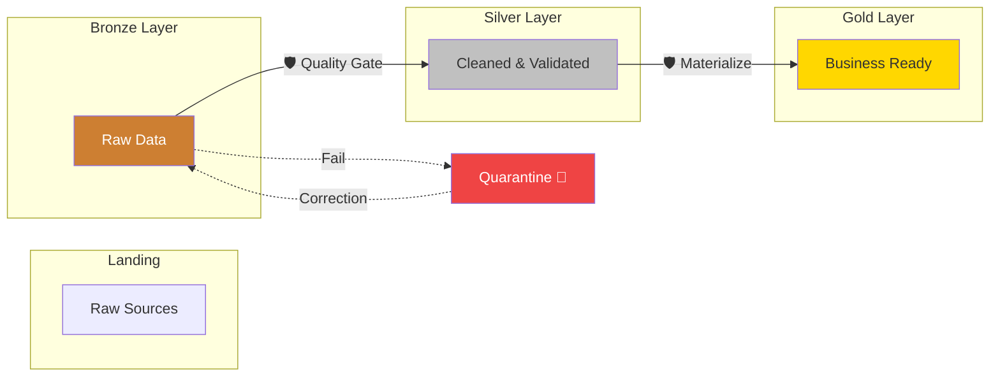

# The Medallion Architecture

LakeGuard is the **quality gate** between the layers of your Data Lakehouse.

## Handling Complex Patterns (Gold)

When moving from **Silver to Gold**, LakeGuard doesn't just check rules; it uses a **Strategy** to build your tables.

### 1. The "Orphaned Key" Problem
Sometimes a transaction (Fact) arrives before its customer info (Dimension). This is a **Late Arriving Dimension**.

**The LakeGuard Solution**:
Instead of losing the transaction, we use the `default_value` feature.
-   If `customer_id` is found: Use it.
-   If `customer_id` is missing: Map it to `-1` (Unknown).
-   This ensures **100% data financial integrity**.

### 2. The Correction Loop
If data fails a rule in **Bronze**, it goes to **Quarantine**. 
1.  **Fix**: The data owner fixes the raw source or provides a correction file.
2.  **Reprocess**: LakeGuard picks up the correction and flows it through to **Silver** and **Gold**.

## Materialization Strategies

| Strategy | When to use it |
| :--- | :--- |
| **`append`** | For giant transaction tables where you just keep adding rows. |
| **`merge`** | For "SCD Type 1" (Updating existing records). |
| **`scd2`** | For "History Tracking" (Keeping old and new versions). |
| **`overwrite`** | For small summary tables or daily snapshots. |
