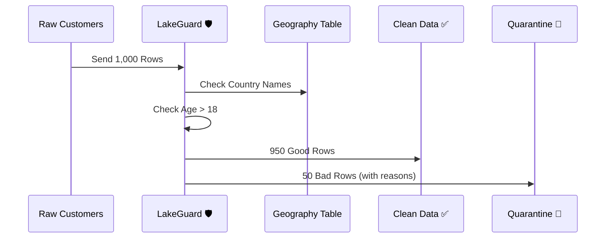

# Example: Managing Customer Data

This example keeps your Customer list clean and safe using a real contract and real data.

## Files

- Contract: `examples/customer_onboarding/contract.yaml`
- Raw data: `examples/customer_onboarding/data/customers.csv`
- Reference data: `examples/customer_onboarding/data/dim_geography.csv`, `examples/customer_onboarding/data/marketing_opt_outs.csv`
- Runner: `examples/customer_onboarding/run.py`

## The Simple Goal
We want to make sure every customer in our list:
1. Has an **email**.
2. Is at least **18 years old**.
3. Is **not** on our "Do Not Contact" list.



## What happens to the "Bad Data"?

When LakeGuard finds a problem, it doesn't just delete it. It puts the row in a special "Bad Data" folder and adds two notes:

| Customer   | Problem         | Why?                         |
| :--------- | :-------------- | :--------------------------- |
| John Doe   | `email_missing` | The email field was empty    |
| Jane Smith | `under_age`     | The birthday shows she is 15 |

## How to try it
1. Run this command in your terminal:
```bash
cd examples/customer_onboarding
python run.py
```
2. Look for `good_customers.csv` and `bad_customers.csv` in this folder.

> Note: This example uses SQL transformations with window functions, which are supported in DuckDB and Spark engines.

## Contract (excerpt)

### Structured Flavor (business-friendly)

```yaml
transformations:
  - rename:
      from: email_address
      to: email
  - trim:
      fields: ["email"]
  - lower:
      fields: ["email"]
  - deduplicate:
      on: ["email"]
      sort_by: ["created_at"]
      order: desc
  - lookup:
      field: country_name
      reference: dim_geography
      on: country_id
      key: country_id
      value: country_name
  - derive:
      field: full_name
      sql: "first_name || ' ' || last_name"
  - map_values:
      field: membership_level
      mapping:
        GOLD: "G"
        SILVER: "S"
      default: "U"
      output: membership_tier
```

### SQL Flavor (advanced control)

```yaml
transformations:
  - sql: |
      SELECT * FROM (
        SELECT
          customer_id,
          email_address AS email,
          first_name,
          last_name,
          birth_date,
          membership_level,
          country_id,
          created_at,
          ROW_NUMBER() OVER (PARTITION BY email_address ORDER BY created_at DESC) AS rn
        FROM source
        WHERE email_address IS NOT NULL
      ) AS t
      WHERE rn = 1
    phase: pre
  - sql: |
      SELECT
        src.*,
        geo.country_name AS country_name
      FROM source src
      LEFT JOIN dim_geography geo ON src.country_id = geo.country_id
    phase: post
```

### When to Use Which
- Use **Structured** when you want readable, intent-first transformations for common patterns.
- Use **SQL** when you need window functions, multi-step joins, or complex filtering logic.

## Raw Input (excerpt)

```csv
customer_id,email_address,first_name,last_name,birth_date,membership_level,country_id
1,john.doe@example.com,John,Doe,1985-05-15,GOLD,1
4,,NoEmail,User,1970-01-01,PLATINUM,3
7,invalid-email,Bad,Email,1990-01-01,BRONZE,2
```
