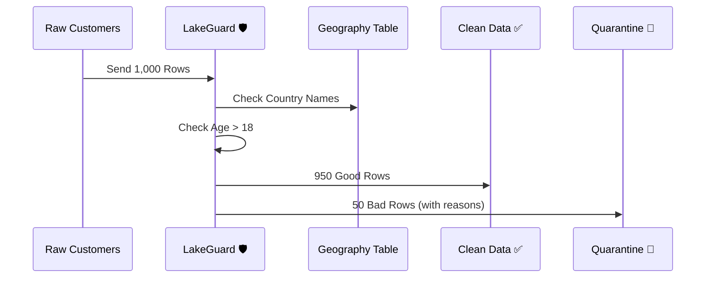

# Example: Managing Customer Data

This example shows how to keep your Customer list clean and safe.

## The Simple Goal
We want to make sure every customer in our list:
1. Has an **email**.
2. Is at least **18 years old**.
3. Is **not** on our "Do Not Contact" list.



## What happens to the "Bad Data"?

When LakeGuard finds a problem, it doesn't just delete it. It puts the row in a special "Bad Data" folder and adds two notes:

| Customer   | Problem         | Why?                         |
| :--------- | :-------------- | :--------------------------- |
| John Doe   | `email_missing` | The email field was empty    |
| Jane Smith | `under_age`     | The birthday shows she is 15 |

## How to try it
1. Copy the `contract.yaml` file from this folder.
2. Run this command in your terminal:
```bash
lakeguard run --engine polars --contract contract.yaml --source customers.csv
```
3. Look for `good_customers.csv` and `bad_customers.csv` in your folder!
