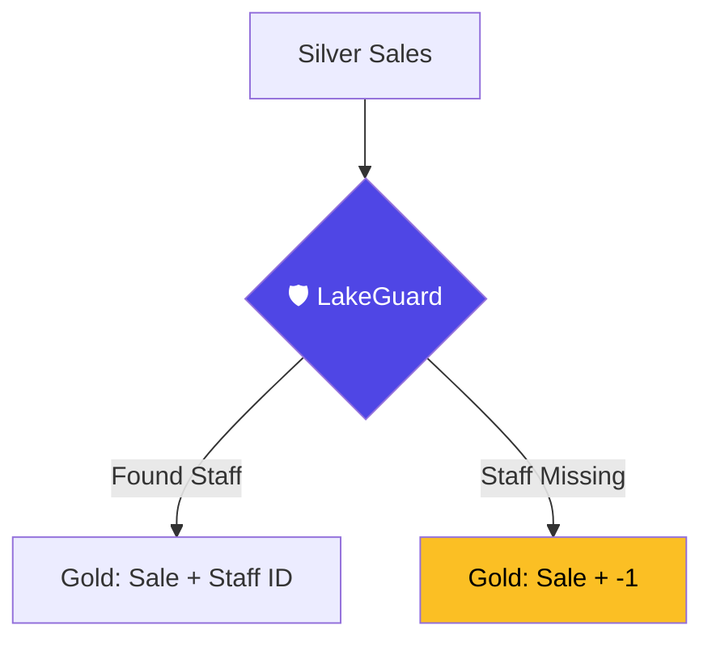

# Example: Gold Layer Sales Fact

This example shows how to build a **Sales Fact** table from your Silver transactions while handling **Late Arriving Dimensions**.

## The Goal
Move sales data to the **Gold** layer. If a salesperson is missing from our system, we map them to `-1` (Unknown) so we don't lose the sale record.

## The Contract (`sales_gold.yaml`)

```yaml
version: 1.0.0
info:
  title: Sales Transactions Gold
  target_layer: gold

strategy: append # Just keep adding new sales

dataset: fact_sales

transformations:
  # ORPHANED KEY HANDLING: 
  # If the salesperson_id isn't in dim_staff, use -1
  - lookup:
      field: staff_key
      reference: dim_staff
      on: salesperson_id
      key: staff_id
      value: staff_surrogate_key
      default_value: -1 

logic: |
  SELECT 
    sale_id,
    sale_date,
    amount,
    staff_key,
    CURRENT_TIMESTAMP as processed_at
  FROM silver_sales
```

## How it handles "Orphans"
When LakeGuard runs this:
1.  It looks at the `silver_sales` table.
2.  It tries to join with `dim_staff`.
3.  If a sale exists but the salesperson doesn't, it uses **`-1`**.
4.  **Result**: Your Total Sales numbers are always 100% accurate, even if your meta-data is lagging!

## The Data Journey


