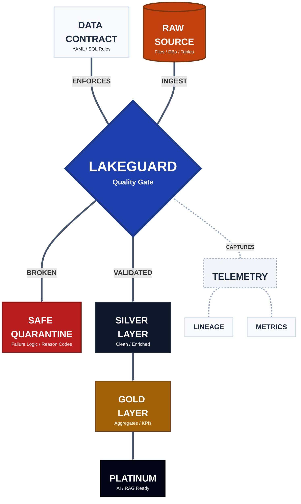

# LakeGuard

**The SQL-First Quality Gate for your Data Lakehouse.**

LakeGuard ensures that your business decisions are based on data you can trust. By separating your **Business Logic (The Intent)** from your **Infrastructure (The Execution)**, LakeGuard lets you enforce strict quality gates across your entire Medallion architecture with **zero code rewrites**.



## The Core Value: Write Once. Run Anywhere

Stop paying the "Re-adaptation Tax." In a traditional stack, moving from a Warehouse (SQL) to a Lakehouse (PySpark) means rewriting your validation rules. With LakeGuard, your **Data Contract is the Source of Truth**.

- **SQL-First:** Define your constraints, rules, and logic in standard SQL—the language your team already speaks.
- **Zero Adaptation:** Move your pipelines from **dbt/Snowflake** to **Databricks/Spark** to **Local/Polars** with **zero changes** to your contract.
- **No Vendor Lock-in:** Your business logic is a portable asset, independent of your cloud provider or execution engine.

## Business ROI: Cost, Risk, & Trust

### 1. Eliminate the "Spark Tax" (Cost Savings)

- **Result:** Cut compute spend by up to 80% for maintenance and small-to-medium datasets.

### 2. 100% Reconciliation (Risk Mitigation)

- **Result:** Mathematically provable data integrity. Bad data is detoured into a **Safe Quarantine** area, ensuring production dashboards are never poisoned.

### 3. Visual Traceability (Stakeholder Trust)

Gold-layer metrics should never be "Black Boxes." LakeGuard supports aggregate roll-ups that preserve source keys.

- **Result:** Provide business users with a visual drill-down from board-level KPIs back to the raw source records.

---

## Technical Capabilities

| Feature | Description |
| :--- | :--- |
| **Declarative Contracts** | Human-readable YAML defines schema, rules, and transforms. |
| **Engine Agnostic** | Auto-discovers and optimizes for Spark, Polars, DuckDB, or Pandas. |
| **SQL-First Rules** | Use standard SQL for Completeness, Correctness, and Consistency checks. |
| **Safe Quarantine** | Isolate bad rows without crashing the pipeline, with built-in reason codes. |
| **Lineage Injection** | Automatically audit every record with Run IDs, Timestamps, and Source paths. |
| **Registry Orchestration** | A generic driver to run Bronze → Silver → Gold layers with parallel execution. |

## Quick Start

The fastest way to get started is with **[uv](https://github.com/astral-sh/uv)**:

```bash
# Install with all engines
uv pip install "lakeguard[all]"

# Run your first contract (auto-discovers the best engine)
lakeguard run --contract my_contract.yaml --source raw_data.parquet
```

## Scale with LineageLogic

LakeGuard is the open-source engine that enforces your rules. For enterprise-scale management, **[LineageLogic](https://lineagelogic.com)** provides:

- **AI-Powered Contract Generation:** Don't write YAML by hand; generate it from your data in seconds.
- **Visual Governance:** See your real-time data health and lineage across your entire mesh.
- **Collaborative Approvals:** Manage contract lifecycle and versioning across decentralized teams.

---

[Quickstart](quickstart.md) | [How It Works](concepts.md) | [Patterns](deployment_patterns.md) | [CLI Usage](cli.md)
