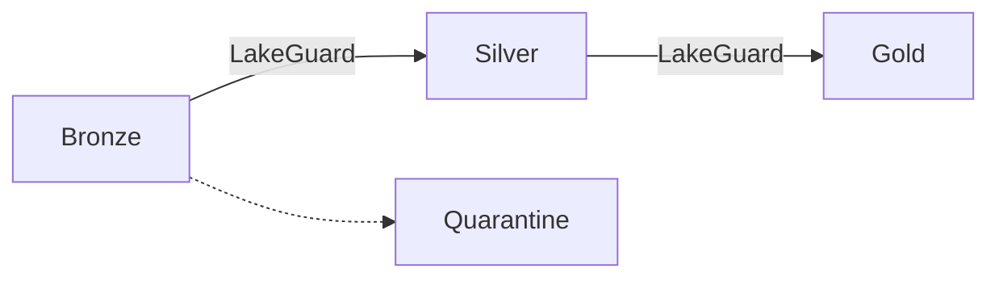

# LakeGuard ???

**The Quality Gate for your Data Lakehouse.**

In a Data Lakehouse, data moves from **Bronze** (Raw) to **Silver** (Filtered, Cleaned, Transformed, Enriched) to **Gold** (Ready). LakeGuard keeps bad data at the gate so it never pollutes downstream tables.



## Start Here

- [Installation](installation.md)
- [Quickstart](quickstart.md)
- [Starter Kit](starter_kit.md)
- [CLI Usage](cli.md)
- [How It Works](concepts.md)
- [Playbooks Overview](playbooks.md)
- [Capability Matrix](capabilities.md)
- [Warehouse Adapters](warehouse_adapters.md)
- [Observability](observability.md)

## ?? Eliminate the "Spark Tax"

LakeGuard is built for **infrastructure efficiency**. Most data contracts do not need a multi-node Spark cluster to validate.

**Run the exact same contract on:**
- **Polars/DuckDB**: Lightning-fast, low-cost execution in single-node containers (AKS, ECS, Lambda, ACA).
- **Spark**: Petabyte-scale pipelines on **Databricks**, **Microsoft Fabric**, **Azure Synapse**, or **Amazon EMR**.
- **Snowflake & BigQuery**: Table-only warehouse adapters with SQL pushdown. See [Warehouse Adapters](warehouse_adapters.md).

By running LakeGuard on Polars for your 1-100GB pipelines, you can cut compute spend dramatically while keeping enterprise-grade validation.

## ?? Core Concept

LakeGuard separates **Intent** from **Execution**:

- **Data Contract = Intent**: Declare what the data must look like and how it should be validated.
- **Engine Adapter = Execution**: LakeGuard runs that contract optimally on your chosen engine.

This keeps your business logic portable whether you are running locally, on **Azure/AWS** Spark platforms, or directly in Snowflake/BigQuery (table-only).

## ? Key Features

- **Declarative Contracts**: Schema, constraints, and transformations in human-readable YAML.
- **Engine Agnostic**: Auto-discovers the best engine (Spark, Polars, DuckDB, Pandas) based on your environment. Warehouse adapters are selected explicitly.
- **Safe Quarantine**: Detour bad rows into a reprocessing area without crashing the pipeline.
- **Lineage Injection**: Automatically tag records with source path, run ID, and processing timestamp.
- **Materialization**: Write validated data to local CSV/Parquet targets or Delta/Iceberg when running on Spark.
- **Lock-in Friendly Defaults**: Quarantine writes default to Parquet files and Iceberg tables, with explicit overrides for Delta, CSV, or JSON.
- **SQL-First Rules**: Use standard SQL for Completeness, Correctness, and Consistency checks.
- **Cross-Platform Governance**: Consistent enforcement across **Databricks**, **Fabric**, **Synapse** (Spark), plus Snowflake/BigQuery (table-only).
- **External Logic Hooks**: Run dedicated Python modules or notebooks for Gold processing when needed.

## ?? Typical Use Cases

- **Containerized Pipelines (AKS/ACA)**: Run millions of checks per second in lightweight Python pods.
- **Data Mesh**: Enforce contracts between decentralized domain teams (Finance, Marketing, HR).
- **Multi-Engine Migration**: Move logic from **Synapse** to **Fabric** or **Databricks** without rewriting rules.
- **Streaming Gates**: Validate micro-batches before they hit your Delta/Iceberg tables.

## Quick Start

The fastest way to get started is with **[uv](https://github.com/astral-sh/uv)**:

```bash
# Install with all engines
uv pip install "lakeguard[all]"

# Run your first contract (auto-discovers Polars/Spark/DuckDB)
lakeguard run --contract my_contract.yaml --source raw_data.parquet
```

If you prefer pip:

```bash
pip install "lakeguard[all]"
```

## ??? Summary

LakeGuard turns your Data Contract from passive documentation into a **living security guard**. It keeps your Medallion architecture clean and trustworthy, while giving you the freedom to choose the most cost-effective engine for the job.

## Next Steps

- [Customer Onboarding Example](examples/customer_onboarding.md)
- [Bronze Ingestion Example](examples/ingestion.md)
- [External Gold Logic Example](examples/external_logic.md)
- [Sales Gold Example](examples/sales_gold.md)
- [Fact Pattern Examples](examples/fact_patterns.md)
