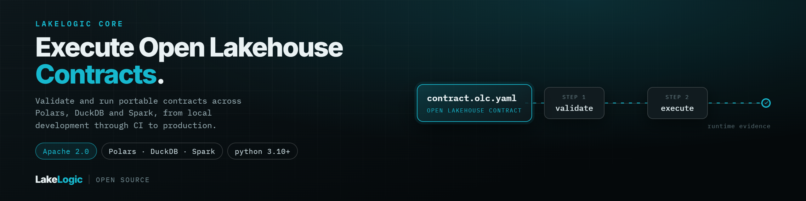

<div class="hero-banner"></div>

<div class="hero-cta"><a class="md-button md-button--primary" href="https://colab.research.google.com/github/LakeLogic/LakeLogic/blob/main/examples/colab/00_quickstart.ipynb" target="_blank">Get started →</a> <a class="md-button md-button--secondary" href="examples.html">Browse examples</a> <a class="md-button" href="installation.html">Install locally</a> <a class="md-button" href="https://github.com/lakelogic/LakeLogic" target="_blank">★ Star on GitHub</a></div>

*The open-source reference framework for Open Lakehouse Contracts.*

Validate and execute OLC contracts across Polars, DuckDB and Spark, from local development through CI and production pipelines.

!!! abstract "Built on the Open Lakehouse Contract"
    LakeLogic is the reference framework for the **[Open Lakehouse Contract (OLC)](https://lakelogic.github.io/open-lakehouse-contract/)** — the open, engine-neutral standard for lakehouse data contracts. Your `.yaml` contracts are portable OLC documents; LakeLogic executes them identically across Polars, DuckDB, and Spark. See the [OLC reference](https://lakelogic.github.io/open-lakehouse-contract/reference/anatomy/) for the full spec.

## How it works

Four steps, one contract file — from a YAML definition to an enforced check in CI.

<div class="ll-howitworks" markdown>
=== "1. Define"

    ```yaml title="orders_contract.yaml"
    version: 1.0.0
    dataset: orders

    info:
      owner: data-team@company.com
      target_layer: silver

    model:
      fields:
        - name: order_id
          type: integer
          required: true
        - name: customer_email
          type: string
          required: true
          pii: true
          masking: partial
        - name: amount
          type: float
          required: true

    quality:
      row_rules:
        - name: valid_email
          sql: "customer_email LIKE '%@%.%'"
        - name: positive_amount
          sql: "amount > 0"
    ```

=== "2. Run"

    ```python title="Python"
    from lakelogic import DataProcessor

    processor = DataProcessor(
        "orders_contract.yaml",
        engine="polars",
    )
    result = processor.run_source("orders.csv")

    print(f"Accepted: {result.good_count}")
    print(f"Quarantined: {result.bad_count}")
    ```

=== "3. Inspect"

    ```text title="Result"
    Accepted: 98
    Quarantined: 2

    Failed records retain diagnostic context:
    - valid_email: customer_email is invalid
    - positive_amount: amount must be greater than 0
    ```

    Row-level failures can be inspected or written to a quarantine target. Dataset-level rules can stop downstream processing when a configured threshold is breached.

=== "4. Check in CI"

    ```bash title="Pre-deployment validation"
    lakelogic validate \
      --contract orders_contract.yaml \
      --gates breaking_change,pii_classification,lineage_break
    ```

    Add the command to your pull-request workflow to reject changes when a configured gate fails. Some gates require comparison or lineage context from your repository.

</div>

---

## Start in Five Minutes

Install the base package:

```bash
pip install lakelogic
```

Then open the [five-minute Colab quickstart](https://colab.research.google.com/github/LakeLogic/LakeLogic/blob/main/examples/colab/00_quickstart.ipynb). It creates sample data, runs a contract, and shows accepted and quarantined records without requiring Spark or cloud credentials.

## Choose an Execution Engine

The contract model is shared across engines, but their storage and catalog capabilities are not identical.

| Engine | Start here when you need | Notes |
| --- | --- | --- |
| **Polars** | Local development, notebooks, CI, and fast single-node processing | Included in the base package. Delta operations use delta-rs. |
| **DuckDB** | Embedded analytical SQL and local workflows | Included in the base package. Some materialization combinations differ from Spark. |
| **Spark** | Distributed lakehouse workloads and managed catalogs | Install with `pip install "lakelogic[spark]"`. Platform configuration still applies. |

Review the [engine and format capability matrix](capabilities.md) before selecting a catalog, table format, or materialization strategy.

## Choose Your Path

<div class="grid cards" markdown>

- :material-check-decagram-outline: **[Build trusted data products](contracts/data_product_contracts/index.md)**
  <hr>
  Define schemas, row rules, dataset rules, quarantine behaviour, service levels, and materialization.

- :material-test-tube: **[Test contracts and generated data](examples.md)**
  <hr>
  Run guided notebooks for quality checks, edge cases, dimensional models, and integrations.

- :material-engine-outline: **[Select engines and deployment patterns](deployment_patterns.md)**
  <hr>
  Compare local, CI, Spark, Delta, Iceberg, and catalog-aware execution paths.

- :material-file-tree: **[Organise domain-owned contracts](organization.md)**
  <hr>
  Structure domains, systems, ownership, shared defaults, and registries without centralising business meaning.

- :material-shield-lock-outline: **[Implement governance controls](contracts/compliance.md)**
  <hr>
  Declare PII-handling and retention patterns, then connect them to the access, audit, and legal controls your organisation requires.

- :material-robot-outline: **[Explore optional AI workflows](llm_extraction.md)**
  <hr>
  Use configured providers to assist contract onboarding or extract structured data before normal contract validation.

</div>

## What LakeLogic Controls

LakeLogic parses contract declarations, executes supported validation and transformation rules, separates accepted and failed records, and emits run evidence. It can also materialize outputs, evaluate service-level thresholds, and invoke configured notification integrations.

LakeLogic does not create domain ownership, cloud permissions, alert-delivery infrastructure, retention jobs, or regulatory compliance by itself. Those responsibilities remain with your platform and organisation. The contract provides a versioned control surface that can participate in them.

For catalog-specific behaviour, see [capabilities](capabilities.md), [cloud integration](cloud_integration.md), and [automatic credentials](automatic_credentials.md).

## LakeLogic vs. LakeLogic Platform

**LakeLogic (open source)** is the reference framework — it runs your OLC contracts anywhere. **LakeLogic Platform** is the commercial layer built on top of it: it consumes the telemetry the open-source framework emits and turns it into org-wide observability, governance, and AI-assisted incident resolution.

| | LakeLogic (open source) | LakeLogic Platform |
| --- | --- | --- |
| License | Apache 2.0 · free | Commercial |
| Run contracts — schema, quality, PII, lineage, SLOs — across Polars / DuckDB / Spark | ✓ | ✓ |
| Local development + CI validation gates | ✓ `lakelogic validate` | ✓ |
| Materialization (Delta / Iceberg / warehouse) | ✓ | ✓ |
| Quarantine, reconciliation, run evidence | ✓ | ✓ |
| Hosting | Self-hosted / your infrastructure | Fully managed |
| Cross-pipeline observability | Emits telemetry | Consumes it |
| Zeus — agentic AI incident diagnosis & resolution (MTTR) | — | ✓ |
| Contract Studio — visual authoring & review | — | ✓ |
| Lineage Explorer + governance / compliance dashboards | — | ✓ |

The contract is the same portable OLC document in both — start on open source, and nothing you write is locked in.

## Continue Learning

- [Installation and optional dependencies](installation.md)
- [Complete annotated contract](contract_template.md)
- [CLI reference](cli.md)
- [Pipeline concepts](pipelines.md)
- [Reconciliation](reconciliation.md)
- [Observability and run evidence](observability.md)
- [Notifications](notifications.md)
- [Architecture](architecture_diagram.md)

---

**Ready to try it?** [Run the quickstart](https://colab.research.google.com/github/lakelogic/LakeLogic/blob/main/examples/colab/00_quickstart.ipynb){: target="_blank" } or [install LakeLogic locally](installation.md).
