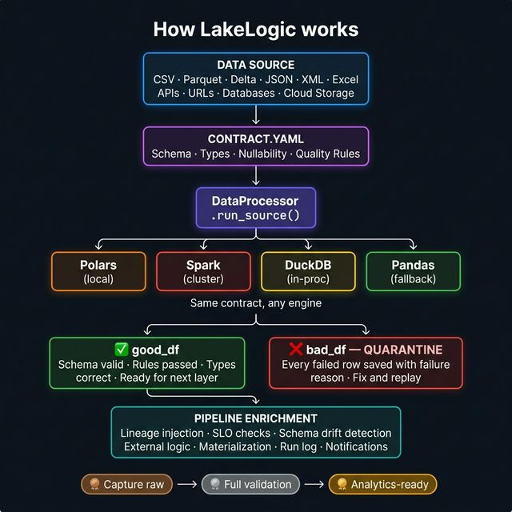

<div class="hero-section" markdown>

# Your Data Estate. <span style="color: var(--md-accent-fg-color);">Under Contract.</span>

<p class="hero-subtitle">
Open-source data contract library for Python — catch breaking data changes before they reach production.
</p>

<div class="hero-cta">
<a href="examples/01_hello_world/" class="md-button md-button--primary">
Try in 60 Seconds
</a>
<a href="https://github.com/lakelogic/LakeLogic" class="md-button">
View on GitHub
</a>
</div>
---

## 🌐 Data Mesh Alignment

LakeLogic is built for the decentralized data estate, directly supporting the four pillars of **Data Mesh**:

- **Domain Ownership**: Contracts are owned and defined by domain teams (e.g., CRM, Finance) who know the data best.
- **Data as a Product**: Contracts serve as the explicit "product interface," guaranteeing quality for consumers.
- **Self-Serve Platform**: A standardized runtime that any team can use to deploy quality gates without infra silos.
- **Federated Governance**: Global standards (e.g., PII masking) are defined centrally but enforced locally at every layer.

---

## ✅ Define Once. Enforce Everywhere.

LakeLogic makes your **Data Contract the Single Source of Truth**.

### `contract.yaml` — this is your entire quality gate
```yaml
# REQUIRED: Contract version for compatibility tracking
version: "1.0"

# REQUIRED: Metadata — who owns this data and where it lives in the org
info:
  title: Silver Customers                 # Human-readable name for logs and monitoring
  owner: data-team                        # Team responsible for this contract
  domain: CRM                             # Data mesh domain (CRM, Finance, Marketing...)
  system: Salesforce                      # Source system this data originates from
  classification: "confidential"          # Data sensitivity: public | internal | confidential | restricted
  status: "production"                    # Lifecycle stage: development | staging | production | deprecated

# OPTIONAL: Custom tags for governance, cost tracking, and SLA enforcement
metadata:
  pii_present: true                       # Flags this dataset as containing personal data
  retention_days: 2555                    # Operational retention policy (7 years) — used by automated purge jobs
  sla_tier: "tier1"                       # SLA priority: tier1 = critical (< 4hr response)

# REQUIRED: Schema definition — expected columns, types, and constraints
# Field descriptions serve two purposes:
#   1. Business documentation — so analysts understand each field without asking
#   2. LLM context — used by `lakelogic bootstrap --ai` to generate smarter rules
model:
  fields:
    - name: customer_id
      type: integer
      required: true                      # Generates automatic NOT NULL quality rule
      description: "Unique identifier for each customer record"
    - name: first_name
      type: string
      pii: true                           # Marks as personally identifiable — enables auto-masking
      description: "Customer's legal first name"
    - name: last_name
      type: string
      pii: true
      description: "Customer's legal last name"
    - name: email
      type: string
      pii: true
      description: "Primary email address used for account login and communications"
    - name: revenue
      type: float
      description: "Lifetime revenue attributed to this customer in base currency"
    - name: status
      type: string
      description: "Current account state: active, churned, or pending onboarding"

# OPTIONAL: Schema evolution and unknown field handling
schema_policy:
  evolution: "strict"                     # Schema change behavior: strict | compatible | allow
  unknown_fields: "quarantine"            # Unknown columns: quarantine | drop | allow

# REQUIRED: Where to load data from (supports files, S3, ADLS, databases)
source:
  type: landing                           # Acquisition pattern: landing (files) | table (DB) | stream (Kafka)
  path: "data/customers/*.csv"            # Glob pattern — also supports s3://, abfss://, Unity Catalog tables
  load_mode: incremental                  # Only process new/changed data: full | incremental | cdc

# OPTIONAL: Reference data for joins and enrichment
links:
  - name: "dim_countries"                  # Logical name used in lookup/join transformations
    path: "./reference/countries.parquet"   # File path, S3 URI, or Unity Catalog table
    type: "parquet"                         # Format: parquet | csv | table
    broadcast: true                        # Broadcast join for small dimensions (Spark)

# OPTIONAL: Environment-specific overrides (activate via LAKELOGIC_ENV)
environments:
  dev:
    path: "dev/customers"                  # Cheaper storage for development
    format: "parquet"
  prod:
    path: "s3://prod-lake/silver/customers"
    format: "delta"

# OPTIONAL: Data transformations — pre (before validation) and post (after validation)
transformations:
  - rename:                               # Fix source naming drift before schema checks
      from: "cust_id"
      to: "customer_id"
    phase: "pre"                          # PRE = applied before quality rules run
  - deduplicate:                          # Keep most recent record per business key
      columns: ["customer_id"]
      order_by: "updated_at"
  - sql: |                                # Full SQL for complex enrichment logic
      SELECT *, UPPER(status) as status_code,
        revenue * 0.1 as tax_estimate
      FROM source
    phase: "post"                         # POST = applied after validation, on good data only

# OPTIONAL: Quality rules — rows that fail are quarantined, not silently dropped
quality:
  row_rules:                              # Row-level: each row evaluated independently
    - sql: "customer_id IS NOT NULL AND email IS NOT NULL"   # Completeness check
    - sql: "status IN ('active', 'churned', 'pending')"     # Enum validation
    - sql: "revenue >= 0"                                    # Range validation
    - sql: "email LIKE '%@%.%'"                              # Format validation
  dataset_rules:                          # Dataset-level: aggregate checks on all good rows
    - unique: "customer_id"               # No duplicate business keys

# OPTIONAL: Data provenance and audit injection
lineage:
  enabled: true                           # Stamps every row with run_id, source path, timestamps

# REQUIRED: Output — where and how to write validated data
materialization:
  strategy: merge                         # Write mode: overwrite | append | merge (upsert)
  target_path: "silver/customers"         # Destination path (also supports Unity Catalog table names)
  format: delta                           # Storage format: delta | parquet | iceberg | csv
  merge_keys: [customer_id]              # Business keys for merge/upsert operations
  partition_by:                           # Partition columns for query performance
    - "country"
    - "created_date"
  cluster_by: ["customer_id"]            # Clustering columns (Delta/Iceberg optimization)
  reprocess_policy: "overwrite_partition" # Idempotent re-runs: overwrite_partition | append | fail

# OPTIONAL: Soft deletes — GDPR "right to erasure" without losing audit trail
soft_deletes:
  enabled: true                           # Mark rows as deleted instead of hard-deleting
  flag_field: "_is_deleted"               # Boolean column added to target table
  reason_field: "_delete_reason"          # e.g. "GDPR request", "duplicate"
  timestamp_field: "_deleted_at"          # When the deletion was recorded

# OPTIONAL: Quarantine — isolate failed rows with error reasons for replay
quarantine:
  enabled: true                           # If false, pipeline hard-fails on any quality error
  target: "quarantine/customers"          # Where bad rows are written (with _lakelogic_errors column)
  notifications:                          # Alert channels when rows are quarantined
    - target: "https://hooks.slack.com/services/YOUR/WEBHOOK"  # Slack, Teams, email auto-detected
      on_events: ["quarantine", "failure", "schema_drift"]

# OPTIONAL: Service Level Objectives — data reliability monitoring
service_levels:
  freshness:
    threshold: "24h"                      # Data must be refreshed within this window
    field: "updated_at"                   # Timestamp field to check staleness against
  availability:
    threshold: 99.9                       # % of runs that must produce valid output

# OPTIONAL: Regulatory compliance metadata — used for audit-ready reports
compliance:
  gdpr:
    applicable: true                      # Whether GDPR applies to this dataset
    legal_basis: "legitimate_interest"    # Art. 6(1) lawful basis for processing
    purpose: "Customer engagement tracking"  # Why this data is processed (Art. 5(1)(b))
    retention_period: "24 months"         # Legal retention limit for PII — separate from operational retention
  eu_ai_act:
    applicable: false                     # Whether EU AI Act applies (for ML feature datasets)
```

!!! tip "Full Contract Reference"
    Explore the **[Complete Contract Template](contract_template.md)** showing every available configuration option for Bronze, Silver, and Gold layers.

---

## Meet the Engines

=== "Polars"

    ```python
    from lakelogic import DataProcessor
    
    # Blazing-fast local processing
    processor = DataProcessor(
        contract="contract.yaml",
        engine="polars"
    )
    
    result = processor.run_source("data.csv")
    
    print(f"✅ {len(result.good)} validated")
    print(f"❌ {len(result.bad)} quarantined")
    ```

=== "Spark"

    ```python
    from lakelogic import DataProcessor
    
    # Petabyte-scale distributed processing
    processor = DataProcessor(
        contract="contract.yaml",
        engine="spark"
    )
    
    # Works with Delta Lake, Unity Catalog
    result = processor.run_source("catalog.schema.table")
    
    processor.materialize(result.good, result.bad)
    ```

=== "DuckDB"

    ```python
    from lakelogic import DataProcessor
    
    # Fast analytical SQL engine
    processor = DataProcessor(
        contract="contract.yaml",
        engine="duckdb"
    )
    
    result = processor.run_source("data.parquet")
    
    # 100% Reconciliation guaranteed
    assert len(result.raw) == len(result.good) + len(result.bad)
    ```


!!! tip "Interactive Examples"
    Jump straight into **executable Jupyter notebooks** that demonstrate LakeLogic's capabilities:
    
    - [Hello World](examples/01_hello_world.ipynb) - Remote data ingestion in 60 seconds
    - [Database Governance](examples/02_database_governance.ipynb) - Quarantine dirty data
    - [HIPAA & GDPR Compliance](examples/hipaa_gdpr_compliance.ipynb) - PII masking, consent tracking, and multi-regulation governance
    - [AI Contract Enrichment](examples/ai_enrich_demo.ipynb) - Generate field descriptions, PII flags, and quality rules with AI

---

## Delta Lake & Catalog Support (Spark-Free!)

LakeLogic automatically resolves catalog table names and uses **Delta-RS** for fast, Spark-free Delta Lake operations.

=== "Unity Catalog (Databricks)"

    ```python
    from lakelogic import DataProcessor
    
    # Use Unity Catalog table names directly (no Spark required!)
    processor = DataProcessor(
        engine="polars", 
        contract="contracts/customers.yaml"
    )
    
    good_df, bad_df = processor.run_source(
        "main.default.customers"
    )
    
    # LakeLogic automatically:
    # 1. Resolves table name to storage path
    # 2. Uses Delta-RS for fast, Spark-free operations
    # 3. Validates data with your contract rules
    
    print(f"Valid: {len(good_df)} | Invalid: {len(bad_df)}")
    ```

=== "Fabric LakeDB (Microsoft)"

    ```python
    from lakelogic import DataProcessor
    
    # Use Fabric table names directly
    processor = DataProcessor(
        engine="polars",
        contract="contracts/sales.yaml"
    )
    
    good_df, bad_df = processor.run_source(
        "myworkspace.sales_lakehouse.customers"
    )
    
    print(f"Valid: {len(good_df)} | Invalid: {len(bad_df)}")
    ```

=== "Synapse Analytics (Azure)"

    ```python
    from lakelogic import DataProcessor
    
    # Use Synapse table names directly
    processor = DataProcessor(
        engine="polars",
        contract="contracts/sales.yaml"
    )
    
    good_df, bad_df = processor.run_source(
        "salesdb.dbo.customers"
    )
    
    print(f"Valid: {len(good_df)} | Invalid: {len(bad_df)}")
    ```

---

## How It Works (In a Nutshell)

LakeLogic enforces **Data Contracts as Quality Gates** at every layer of your medallion architecture:



[:octicons-arrow-right-24: See detailed architecture](architecture_diagram.md)

---

## Why LakeLogic?

### Stop the "Fragmented Truth" Problem
In a traditional data stack, moving from a Warehouse (SQL) to a Lakehouse
(PySpark) means rewriting your validation rules. This duplication creates
**Logic Drift** — where your data quality standards differ depending on
which tool is running the code.

With LakeLogic, your **Data Contract is the Source of Truth**.

- **SQL-First Simplicity**: Define your constraints and business logic in standard SQL—the language your team already speaks.
- **Zero-Friction Portability**: Move your pipelines from **dbt/Snowflake** to **Databricks/Spark** to **Local/Polars** with zero changes to your contract.
- **True Ownership**: Your business logic is a portable asset, independent of your cloud provider or execution engine.

### Business Impact: Trust, Speed, and ROI

!!! success "Slash Compute Costs"
    Not every job needs a massive Spark cluster. Reduce compute spend by up to 80% for maintenance tasks and small-to-medium datasets by using high-performance engines like Polars or DuckDB.

!!! info "Guaranteed Integrity"
    LakeLogic detours bad data into a **Safe Quarantine** zone with absolute precision. This ensures downstream dashboards are never poisoned by "dirty" data, maintaining stakeholder trust.

!!! tip "Full Pipeline Transparency"
    Eliminate the "Black Box" problem. LakeLogic provides visual drill-downs from board-level KPIs back to the raw source records, ensuring every number is auditable and explainable.

---

## Technical Capabilities

| Feature | Description |
| :--- | :--- |
| **Declarative Contracts** | Human-readable YAML defines schema, rules, and transforms. |
| **Engine Agnostic** | Auto-discovers and optimizes for Spark, Polars, DuckDB, or Pandas. |
| **SQL-First Rules** | Use standard SQL for Completeness, Correctness, and Consistency checks. |
| **Safe Quarantine** | Isolate bad rows without crashing the pipeline, with built-in reason codes. |
| **Lineage Injection** | Automatically audit every record with Run IDs, Timestamps, and Source paths. |
| **Registry Orchestration** | A generic driver to run Bronze → Silver → Gold layers with parallel execution. |

---

## Quick Start

The fastest way to get started is with **[uv](https://github.com/astral-sh/uv)**:

```bash
# Install with all engines
uv pip install "lakelogic[all]"

# Run your first contract (auto-discovers the best engine)
lakelogic run --contract my_contract.yaml --source raw_data.parquet
```

---

## Go Further with LakeLogic

LakeLogic is the open-source engine that enforces your data contracts.
Here's how to get the most out of it:

- :material-robot-outline: **AI-Powered Contract Generation:** [Bootstrap
  contracts](llm_extraction.md) from raw data with `--ai` — field descriptions, PII detection,
  and SQL quality rules generated in seconds.
- :material-file-tree: **Governance at Scale:** Learn how to [organize your 
  contracts](organization.md) for 1,000s of tables using Domain-First ownership 
  and Registries.
- :material-card-text-outline: **Contract Reference:** Explore the [Complete 
  Contract Template](contract_template.md) showing every available 
  configuration option for Bronze, Silver, and Gold layers.
- :material-molecule: **Detailed Architecture:** Explore how LakeLogic enforces
  [Quality Gates across the Medallion Architecture](architecture_diagram.md)
  including Quarantine logic, Lineage, and multi-engine support.
- :material-test-tube: **Synthetic Test Data:** Generate realistic edge-case
  data from your contracts to stress-test quarantine rules before production.
- :material-web: **Project Hub:** Visit **[lakelogic.org](https://lakelogic.org)**
  for the latest guides, blog posts, and community resources.

---

## From the Blog

!!! abstract "Latest Posts"
    - [**Data Quality Management Without the Platform Tax**](https://lakelogic.org/blog/data-quality-management/)
      — Why YAML contracts beat enterprise DQM platforms on cost, flexibility, 
      and version control.
    - [**Row-Level Data Quality in Polars — Without Writing Validation Code**](https://lakelogic.org/blog/polars-data-quality/)
      — One YAML file replaces 200 lines of Polars validation boilerplate.
    - [**Data Mesh Without the Chaos**](https://lakelogic.org/blog/data-mesh-data-contracts/)
      — How data contracts make domain ownership work at enterprise scale.
    - [**Stop the Spark Tax**](https://lakelogic.org/blog/stop-the-spark-tax/)
      — One data contract, any engine — eliminate logic drift 
      between Spark, Polars, and DuckDB.

---

[Quickstart](examples/01_hello_world.ipynb) | [How It Works](concepts.md) | [Patterns](deployment_patterns.md) | [CLI Usage](cli.md)
