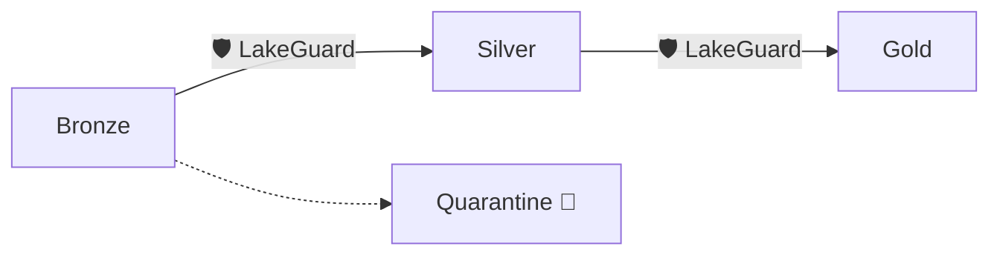

# LakeGuard 🛡️

**The Quality Gate for your Data Lakehouse.**

In a Data Lakehouse, data moves from **Bronze** (Raw) to **Silver** (Filtered, Cleaned, Transformed, Enriched) to **Gold** (Ready). LakeGuard ensures that bad data is caught at the gate and never pollutes your downstream tables.



## 💰 Eliminate the "Spark Tax"

LakeGuard is designed for **Infrastructure Efficiency**. Most data contracts don't need a multi-node Spark cluster to validate. 

**Run the exact same contract on:**
- ⚡ **Polars/DuckDB**: For extreme speed and low-cost execution in single-node containers (Azure Kubernetes Service - AKS, Amazon ECS, AWS Lambda, or Azure Container Apps - ACA).
- 🐘 **Spark**: For petabyte-scale datasets on Databricks or Amazon EMR (Elastic MapReduce).

By switching to **LakeGuard on Polars** for your 1-100GB pipelines, you can reduce your cloud compute costs by up to **80%** while maintaining enterprise-grade validation.

## 🧠 Core Concept

LakeGuard separates the **Intent** from the **Execution**:

-   **Data Contract = Intent**: You declare what the data *must* look like and how it should be validated.
-   **Engine Adapter = Execution**: LakeGuard interprets that contract and runs it optimally on your chosen engine.

This ensures your business logic stays pure and portable, regardless of whether you're running a small research script or a massive production pipeline.

## 🌟 Key Features

-   **Declarative Contracts**: Schema, constraints, and transformations in human-readable YAML.
-   **Engine Agnostic**: Switch between Polars, DuckDB, Spark, and Pandas by changing one flag.
-   **Safe Quarantine**: Detour bad rows into a "reprocessing area" without crashing the entire pipeline.
-   **SQL-First Rules**: Use standard SQL for Completeness, Correctness, and Consistency checks.
-   **Governance Ready**: Built-in support for PII classifications, SLA monitoring, and domain-first registries.

## 🎯 Typical Use Cases

-   **Containerized Pipelines (AKS/ACA)**: Run millions of checks per second in a lightweight Python Pod on Azure Kubernetes Service (AKS) or Azure Container Apps (ACA).
-   **Data Mesh**: Enforce contracts between decentralized domain teams (Finance, Marketing, HR).
-   **Streaming Gates**: Validate micro-batches in real-time before they hit your Delta/Iceberg tables.
-   **Dev → Prod Scale**: Develop locally on Polars and promote to Spark without changing a line of logic.

## Quick Start

The fastest way to get started is with **[uv](https://github.com/astral-sh/uv)**:

```bash
# Install with all engines
uv pip install "lakeguard[all]"

# Run your first contract
lakeguard run --contract my_contract.yaml --source raw_data.parquet --engine polars
```

## 🛡️ Summary
LakeGuard turns your Data Contract from "passive documentation" into a **living security guard**. It manages your Medallion architecture automatically—Ensuring your **Silver** layer is Filtered, Cleaned, Transformed, and Enriched—giving you the freedom to choose the most cost-effective engine for the job.
