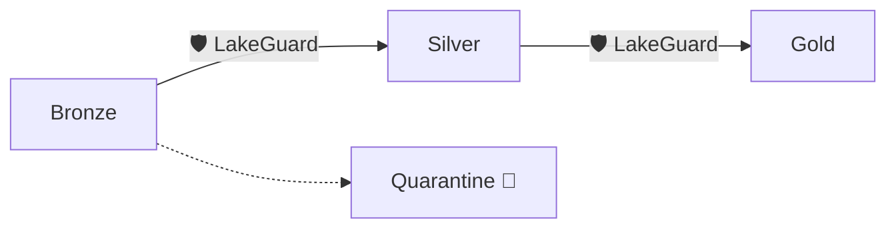

# LakeGuard 🛡️

**The Quality Gate for your Data Lakehouse.**

In a Data Lakehouse, data moves from **Bronze** (Raw) to **Silver** (Cleaned) to **Gold** (Ready). LakeGuard ensures that bad data is caught at the gate and never pollutes your downstream tables.



## 🧠 Core Concept

LakeGuard separates the **Intent** from the **Execution**:

-   **Data Contract = Intent**: You declare what the data *must* look like and how it should be validated.
-   **Engine Adapter = Execution**: LakeGuard interprets that contract and runs it optimally on your chosen engine (Spark, Polars, etc.).

This ensures your business logic stays pure and portable, regardless of whether you're running a small research script or a massive production pipeline.

## 🌟 Key Features

-   **Declarative Contracts**: Schema, constraints, and transformations in human-readable YAML.
-   **SQL-First Rules**: Complete support for Completeness, Correctness, and Consistency checks via SQL.
-   **Engine Agnostic**: Run the same metadata logic on local files and cloud-scale clusters.
-   **Safe Quarantine**: Stop bad data from polluting your lakehouse without crashing your pipelines.

## 🎯 Typical Use Cases

-   **Data Mesh**: Enforce contracts between decentralized data teams.
-   **Lakehouse Gates**: Protect Silver and Gold layers from Bronze-layer "garbage."
-   **Dev → Prod Scale**: Develop on Polars/DuckDB locally and switch to Spark for Production without changing any logic.
-   **Governance & Audit**: Turn contracts from "passive documentation" into enforced runtime guarantees.

1.  **Define Once**: Create a YAML Data Contract (ODCS-aligned).
2.  **Execute Anywhere**: Run the same contract on Polars, Pandas, DuckDB, or Spark.
3.  **Automated Governance**: Built-in quarantine, PII classification, and alerting.

## Quick Start

The fastest way to get started is with **[uv](https://github.com/astral-sh/uv)**:

```bash
# Install with all engines
uv pip install "lakeguard[all]"

# Run your first contract
lakeguard run --contract contract.yaml --source data.csv --engine polars
```

## Core Features

- 🛡️ **Engine Agnostic**: Switch engines by changing one string.
- 🧪 **SQL-First**: Use the SQL you already know for rules and transformations.
- 📦 **Quarantine Layer**: Automatically isolate bad data with detailed failure reasons.
- 🔔 **Multi-Channel Alerts**: Notify owners via Email, Slack, or Teams.
- 🔗 **Referential Integrity**: Validate keys against external dimensions.
