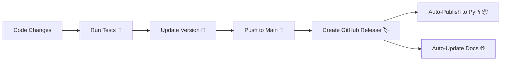

# Release & Maintenance Guide 🔄

Maintaining a reliable release cycle is key to building trust with your users. Here is the recommended "SemVer" (Semantic Versioning) cycle for LakeGuard.

## 1. Versioning Strategy (X.Y.Z)

-   **MAJOR (X.0.0)**: Breaking changes. (e.g., changing the core YAML structure from ODCS to something else).
-   **MINOR (0.Y.0)**: New features. (e.g., adding a new "Gold" strategy like SCD4 or adding a BigQuery adapter).
-   **PATCH (0.0.Z)**: Bug fixes. (e.g., fixing a SQL injection risk or updating a dependency).

## 2. The Standard Release Cycle



### Step 1: Quality Check
Before every release, run the automated test suite locally:
```bash
uv run pytest
```

### Step 2: Bump the Version
Update the version number in `pyproject.toml`:
```toml
[project]
version = "0.1.1" # Increase the last digit for a bug fix
```

### Step 3: The "Grand Launch" (The Git Tag)
When you are ready to go live, create a **Release** on GitHub. 
1. Go to "Releases" on your GitHub sidebar.
2. Click "Draft a new release."
3. Create a tag (e.g., `v0.1.1`).
4. Write a brief "What's New" list (Changelog).

**As soon as you hit "Publish Release":**
- The **Publish to PyPi** action will build your code and push it to the world.
- The **Deploy Documentation** action will update your website with any new guides.

---

## 3. Communication Strategy

-   **Minor Releases**: Write a short LinkedIn/Twitter post highlighting the new feature.
-   **Patch Releases**: Quietly update; users will get the fix the next time they install.
-   **Milestone (0.5.0, 1.0.0)**: This is when you do a "Product Hunt" launch or a deep-dive technical blog post.

## 4. Handling Issues
Encourage users to open **GitHub Issues**. 
1. If a user finds a bug, they open an issue.
2. You create a branch `fix/issue-description`.
3. You fix it, run tests, and merge back to main.
4. This triggers a new `PATCH` release (0.0.Z).
