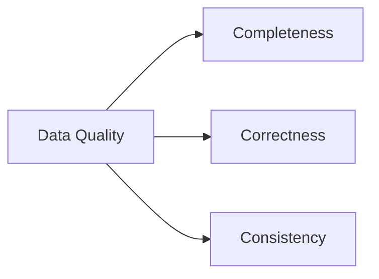

# Monitoring, Lineage & Observability

> Note: The OSS release includes lineage injection, run logs (JSON + table backends), quarantine ratios, and SLO scoring (freshness/availability). Full orchestration remains on the roadmap.

Building a Data Lakehouse is only half the battle. Operating it requires transparency that ensures stakeholders trust the data. LakeLogic provides a practical set of visibility tools across **Data Quality**, **Lineage**, and **Observability**.

---

## 1. Data Quality Health
LakeLogic treats data quality as a first-class citizen during the transmission process.

- **Automated health scores**: quarantine ratio per run plus freshness/availability SLOs.
- **Rule categorization**: rules are tagged by category (e.g., `completeness`, `correctness`, `consistency`) to help triage issues.
- **Fail-fast vs. quarantine**: set `quarantine.enabled: false` to hard-fail or keep quarantine enabled to continue.

### The 3Cs of Data Quality

LakeLogic uses the classic 3Cs to classify rules and make triage faster:

- **Completeness**: required fields exist and are not null.
- **Correctness**: values satisfy business or validation rules.
- **Consistency**: values align across reference sets or systems.



---

## 2. System-Level Lineage
In a complex lakehouse, you must be able to prove "this Gold aggregate came from these Silver rows, which came from these Bronze files."

### Minimal lineage (only what you need)
You can capture only a run id and keep everything else in the run log table:

```yaml
lineage:
  enabled: true
  capture_run_id: true
  capture_timestamp: false
  capture_source_path: false
  capture_domain: false
  capture_system: false
```

**Important behavior**: if you explicitly set any `capture_*` field, only those explicitly set fields are emitted. This makes it safe to keep only `_lakelogic_run_id` in tables.

### Preserve upstream lineage
You can preserve upstream lineage columns before stamping the current run:

```yaml
lineage:
  enabled: true
  preserve_upstream: ["_lakelogic_run_id"]
  upstream_prefix: "_upstream"
```

This produces `_upstream_run_id` (or `_upstream_lakelogic_run_id`, depending on naming) while still adding the current `_lakelogic_run_id`.

### Use pipeline_run_id as the run_id column
For Gold (or any stage) you can use a pipeline-level id for `_lakelogic_run_id`:

```yaml
lineage:
  enabled: true
  capture_run_id: true
  run_id_source: pipeline_run_id
```

When a `pipeline_run_id` is passed to `DataProcessor`, `_lakelogic_run_id` will be set to that value.

### Key roll-ups (Gold traceability)
Gold aggregates can retain rollup lineage keys for drill-down. LakeLogic supports an explicit rollup transform:

```yaml
transformations:
  - rollup:
      group_by: ["sale_date"]
      aggregations:
        total_sales: "SUM(amount)"
      keys: "sale_id"
      rollup_keys_column: "_lakelogic_rollup_keys"
      rollup_keys_count_column: "_lakelogic_rollup_keys_count"  # optional
      upstream_run_id_column: "_upstream_run_id"                # optional
      upstream_run_ids_column: "_upstream_lakelogic_run_ids"     # optional
```

All rollup outputs are optional. If you omit a column name, it will not be created.

---

## 3. Observability & Alerting
Observability is about knowing your data is broken before your users do.

### Proactive notifications
LakeLogic dispatches alerts to multiple channels (Slack, Teams, Email) based on runtime events:
- **`quarantine`**: send a message when row-level errors exceed a threshold.
- **`failure`**: trigger a webhook or pager when a dataset-level rule fails.

### Run logging & auditing
Every execution provides a structured log of:
1. **Counts**: source, total (post-transform), good, quarantined, pre-transform dropped.
2. **SLOs**: freshness and availability scores.
3. **Reasoning**: exact rule definitions that failed for quarantined rows.
4. **Source manifest**: `source_files_json` plus `max_source_mtime` for incremental workflows.

Enable run logs by adding one of the following to `metadata`:

```yaml
metadata:
  run_log_path: logs/lakelogic_run.json
  # or
  run_log_dir: logs/
```

To write logs into a table (Unity Catalog, DuckDB, SQLite), use:

```yaml
metadata:
  run_log_table: main.governance.lakelogic_runs
  run_log_backend: spark   # spark | duckdb | sqlite
  run_log_database: logs/lakelogic_run_logs.duckdb  # used for duckdb/sqlite only
  run_log_merge_on_run_id: true  # idempotent upsert on run_id (Delta/Spark)
  run_log_table_format: delta    # delta | parquet (spark only)
```

LakeLogic will create the table if it doesn't exist and append a new run record on every execution.

### Example run log (JSON)

```json
{
  "run_id": "3c2b6e1e-8b4a-4c2e-9b71-9a6d6f9c7b2a",
  "pipeline_run_id": "f4f86bb1d6ad4a7a8db74ea95aa324e5",
  "timestamp": "2026-02-05T12:34:56.789+00:00",
  "engine": "polars",
  "contract": "Customer Master Data",
  "stage": "silver",
  "source_path": "examples/quickstart/data/customers.csv",
  "counts": {
    "source": 12,
    "total": 9,
    "good": 5,
    "quarantined": 4,
    "pre_transform_dropped": 3,
    "quarantine_ratio": 0.4444
  },
  "max_source_mtime": 1707130496.0,
  "source_files": ["data/crm_2026_02_01.csv", "data/crm_2026_02_02.csv"],
  "slos": {
    "freshness": {"age_seconds": 7200, "threshold_seconds": 86400, "passed": true},
    "availability": {"ratio": 0.98, "threshold": 0.95, "passed": true}
  }
}
```

### Example run log table row

| Column | Example |
| --- | --- |
| run_id | 3c2b6e1e-8b4a-4c2e-9b71-9a6d6f9c7b2a |
| pipeline_run_id | f4f86bb1d6ad4a7a8db74ea95aa324e5 |
| timestamp | 2026-02-05T12:34:56.789+00:00 |
| engine | polars |
| contract | Customer Master Data |
| stage | silver |
| counts_source | 12 |
| counts_total | 9 |
| counts_good | 5 |
| counts_quarantined | 4 |
| counts_pre_transform_dropped | 3 |
| quarantine_ratio | 0.4444 |
| max_source_mtime | 1707130496.0 |

### Example queries

Quarantine trend by day:

```sql
SELECT
  DATE(timestamp) AS run_date,
  AVG(quarantine_ratio) AS avg_quarantine_ratio
FROM main.governance.lakelogic_runs
GROUP BY DATE(timestamp)
ORDER BY run_date;
```

SLO failures in the last 7 days:

```sql
SELECT
  run_id,
  timestamp,
  freshness_pass,
  availability_pass
FROM main.governance.lakelogic_runs
WHERE timestamp >= CURRENT_DATE - INTERVAL '7' DAY
  AND (freshness_pass = false OR availability_pass = false)
ORDER BY timestamp DESC;
```

---

## Summary: Business value

- **Faster incident response**: pinpoint bad data back to its source quickly.
- **Lower operational risk**: enforce SLOs and quarantine to prevent silent failures.
- **Audit readiness**: run logs and lineage provide a verifiable trail.
- **Self-serve trust**: analysts can see exactly where data came from.

By combining quality, lineage, and observability, LakeLogic turns your lakehouse into a transparent and defensible data platform.
