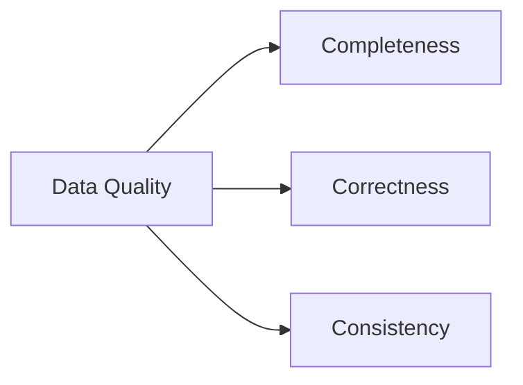
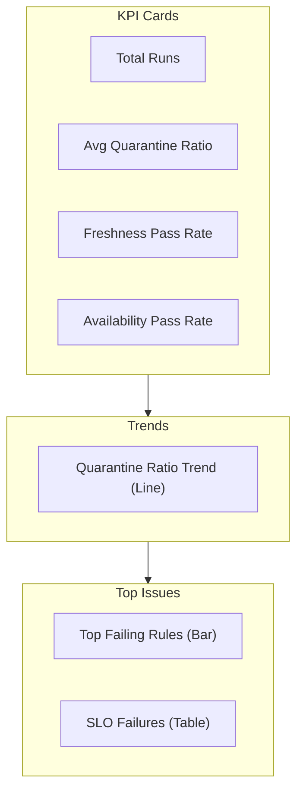
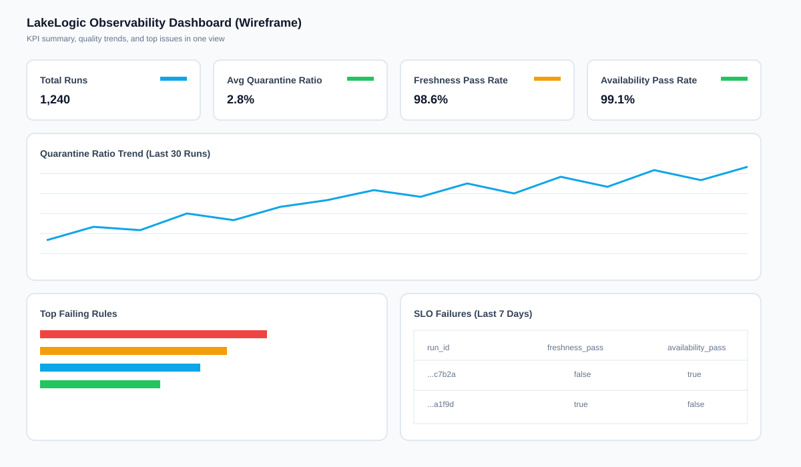

# Monitoring, Lineage & Observability

> Note: The OSS release includes lineage injection, quarantine ratios, run logs, and SLO scoring (freshness/availability). Full orchestration remains on the roadmap.

Building a Data Lakehouse is only half the battle. **Operating** it requires a level of transparency that ensures stakeholders trust the data. LakeGuard provides a "Triple Crown" of operational visibility: **Data Quality**, **Lineage**, and **Observability**.

---

## 1. Data Quality Health
LakeGuard treats data quality as a first-class citizen during the transmission process.

- **Automated Health Scores**: Quarantine Ratio per run plus freshness/availability SLOs.
- **Rule Categorization**: Rules are tagged by category (e.g., `completeness`, `correctness`, `consistency`) to help triage issues.
- **Fail-Fast vs. Quarantine**: Set `quarantine.enabled: false` to hard-fail or keep quarantine enabled to continue.

### The 3Cs of Data Quality

LakeGuard uses the classic 3Cs to classify rules and make triage faster:

- **Completeness**: Required fields exist and are not null.
- **Correctness**: Values satisfy business or validation rules.
- **Consistency**: Values align across reference sets or systems.



## 2. System-Level Lineage
In a complex lakehouse, you must be able to prove "this Gold aggregate came from these Silver rows, which came from these Bronze files."

### Automatic Injection
LakeGuard can automatically inject lineage columns into every record. This audit trail persists even if row-level rules fail.

```yaml
lineage:
  enabled: true
  capture_source_path: true  # Know exactly which file produced this row
  capture_timestamp: true    # Know exactly when it was processed
  source_column_name: "_lakeguard_origin"
```

### Key Roll-ups (Fact Traceability)
For Gold aggregates, LakeGuard supports "Key Rolling" where you aggregate the IDs of the source records, ensuring you can always drill down from a chart into the raw evidence.

## 3. Observability & Alerting
Observability is about knowing your data is broken **before** your users do.

### Proactive Notifications
LakeGuard dispatches alerts to multiple channels (Slack, Teams, Email) based on specific run-time events:
- **`quarantine`**: Send a message to a Slack channel when row-level errors exceed a threshold.
- **`failure`**: Trigger a PagerDuty or webhook when a dataset-level rule (e.g., Total Sales Match) fails.

### Run Logging & Auditing
Every execution provides a structured log of:
1. **Counts**: Total, Good, Bad, and Quarantine Ratio.
2. **SLO**: Freshness and Availability scores.
3. **Reasoning**: Exact rule definitions that failed for the quarantined rows.

Enable run logs by adding one of the following to `metadata`:

```yaml
metadata:
  run_log_path: logs/lakeguard_run.json
  # or
  run_log_dir: logs/
```

To write logs into a Lakehouse table (e.g., Unity Catalog), use:

```yaml
metadata:
  run_log_table: main.governance.lakeguard_runs
  run_log_backend: spark   # spark | duckdb | sqlite
  run_log_database: logs/lakeguard_run_logs.duckdb  # used for duckdb/sqlite only
  run_log_merge_on_run_id: true  # idempotent upsert on run_id (Delta/Spark)
  run_log_table_format: delta    # delta | parquet (spark only)
```

LakeGuard will create the table if it doesn't exist and append a new run record on every execution.
For Unity Catalog or other Lakehouse catalogs, run with the Spark engine.

### Example Run Log (JSON)

```json
{
  "run_id": "3c2b6e1e-8b4a-4c2e-9b71-9a6d6f9c7b2a",
  "timestamp": "2026-02-05T12:34:56.789+00:00",
  "engine": "polars",
  "contract": "Customer Master Data",
  "source_path": "examples/quickstart/data/customers.csv",
  "counts": {
    "total": 9,
    "good": 5,
    "quarantined": 4,
    "quarantine_ratio": 0.4444
  },
  "slos": {
    "freshness": {
      "age_seconds": 7200,
      "threshold_seconds": 86400,
      "passed": true
    },
    "availability": {
      "ratio": 0.98,
      "threshold": 0.95,
      "passed": true
    }
  },
  "dataset_rules": [
    {"name": "unique_emails", "value": 0, "passed": true}
  ],
  "row_rule_failures": [
    {"name": "valid_email_format", "count": 1}
  ],
  "schema_drift": {
    "missing_fields": [],
    "unknown_fields": [],
    "policy": "quarantine"
  }
}
```

The table backend stores the same information in columnar form for analytics and dashboards.

### Example Run Log Table Row

| Column | Example |
| --- | --- |
| run_id | 3c2b6e1e-8b4a-4c2e-9b71-9a6d6f9c7b2a |
| timestamp | 2026-02-05T12:34:56.789+00:00 |
| engine | polars |
| contract | Customer Master Data |
| counts_total | 9 |
| counts_good | 5 |
| counts_quarantined | 4 |
| quarantine_ratio | 0.4444 |
| freshness_pass | true |
| availability_pass | true |

### Example Queries

Quarantine trend by day:

```sql
SELECT
  DATE(timestamp) AS run_date,
  AVG(quarantine_ratio) AS avg_quarantine_ratio
FROM main.governance.lakeguard_runs
GROUP BY DATE(timestamp)
ORDER BY run_date;
```

SLO failures in the last 7 days:

```sql
SELECT
  run_id,
  timestamp,
  freshness_pass,
  availability_pass
FROM main.governance.lakeguard_runs
WHERE timestamp >= CURRENT_DATE - INTERVAL '7' DAY
  AND (freshness_pass = false OR availability_pass = false)
ORDER BY timestamp DESC;
```

Top runs with highest quarantine ratio:

```sql
SELECT
  run_id,
  timestamp,
  quarantine_ratio
FROM main.governance.lakeguard_runs
ORDER BY quarantine_ratio DESC
LIMIT 10;
```

### Visuals for Dashboards

- Quarantine ratio trend (line chart)
- Freshness and availability pass rates (scorecards)
- Top failing rules (bar chart)

#### Dashboard Wireframe (Mermaid)



#### Dashboard Mock (SVG)



### Freshness & Availability Scoring
You can define SLOs in the contract to compute freshness and availability scores per run:

```yaml
service_levels:
  freshness:
    field: updated_at
    threshold: 24h
  availability:
    field: email
    threshold: 99.0
```

Freshness measures how old the most recent record is. Availability measures the non-null ratio for the chosen field (or good/total if no field is provided).

---

## Summary: The Governance Tier

| Feature | Goal | Benefit |
| :--- | :--- | :--- |
| **Data Quality** | Precision | Stakeholders trust the numbers. |
| **Lineage** | Traceability | Developers can debug in minutes, not days. |
| **Observability** | Awareness | No "silent failures" in the middle of the night. |

By combining these three pillars, LakeGuard transforms your Data Lakehouse into a **Transparent Data Factory**.
