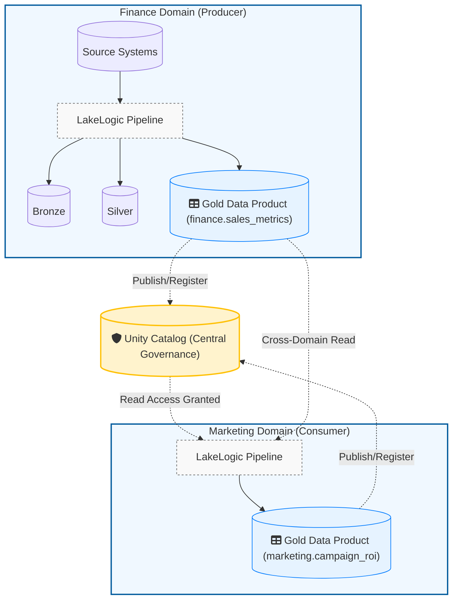
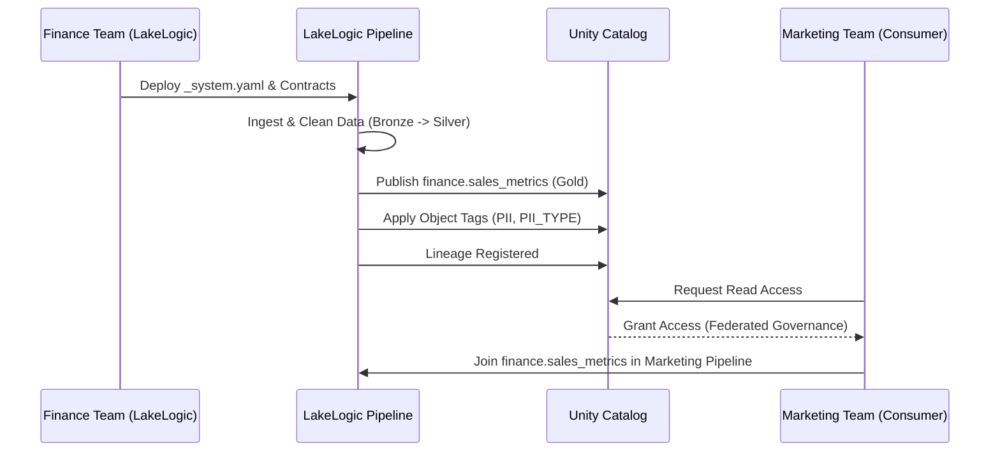

# Contract Organization

> **Think of contracts like franchise manuals.**
> Every McDonald's operates differently (different staff, different suppliers), but they all follow the same playbook for food safety. Data contracts work the same way — each domain runs independently but follows shared quality standards.

As your data estate grows from 10 to 1,000+ tables, how you organize contracts determines whether your team stays agile or drowns in "Contract Sprawl."

---

## 1. Domain-First Ownership

> [!NOTE]
> These are **recommended patterns** for enterprise-grade data estates. Registry
> resolution (domain → system → environment → contract) is **implemented** — see
> [Configuration Resolution & Inheritance](contracts/inheritance.md) for the exact
> precedence and order. Contracts are declared in each `_system.yaml`'s `contracts:`
> index (not yet auto-discovered by globbing).

Organize your repository by **business domain**, not by technical layer. This aligns with Data Mesh principles — the teams who know the data best own the contracts.

```text
contracts/
├── finance/                    ← Domain (ownership boundary)
│   ├── _domain.yaml            ← Domain ownership and routing
│   ├── sap_erp/                ← Source system
│   │   ├── _system.yaml        ← System-level registry (materialization default, configs)
│   │   ├── bronze/
│   │   │   └── bronze_erp_customers.yml
│   │   └── silver/
│   │       └── silver_erp_customers.yml
│   └── payment_gateway/
├── marketing/
└── shared/                     ← Global entities (dates, countries)
```

**Why this matters:**

| Benefit | Without domains | With domains |
| :--- | :--- | :--- |
| **Incident routing** | "Whose data is this?" → 30 min to find the owner | Auto-routed to the domain team |
| **Change isolation** | Marketing update breaks Finance pipeline | Decoupled — each domain deploys independently |
| **Shared standards** | Country codes defined 12 different ways | `shared/` provides one source of truth |

### Data Mesh & Unity Catalog Topology

When deployed on Databricks, LakeLogic acts as the federated governance and orchestration layer while Unity Catalog serves as the physical technical boundary. Each Data Domain securely publishes, reads, and curates its own Data Products.



This alignment means `contracts/finance/` in LakeLogic directly dictates the governance for the `finance` catalog in Unity Catalog.



---

## 2. System Definition (`_system.yaml`) as a Control Plane

Instead of repeating materialization logic, defaults, and cross-references in every single contract, use the `_system.yaml` control plane:

```yaml
# finance/sap_erp/_system.yaml
system: sap_erp

materialization:
  bronze:
    strategy: append
    partition_by: ["ingestion_date"]
    format: delta
  silver:
    strategy: merge
    format: delta

quality:
  fail_pipeline_on_dataset_error: true
  fail_pipeline_on_row_error: false
```

**Why this matters:**

- **Zero-downtime upgrades** — change storage locations or partition strategies at the system level and all underlying tables inherit it instantly.
- **Auditability** — the system config is a single ledger for how an entire source system behaves.
- **DRY Contracts** — engineers only define the columns and rules that are unique to the table.

---

## 3. Governance Metadata

Every contract should include governance-rich metadata that transforms your YAML files into a **searchable data catalog**:

| Field | Business value |
| :--- | :--- |
| `owner` | Routing for data quality alerts and incident response |
| `status` | Lifecycle management (`draft` → `active` → `deprecated`) |
| `classification` | Automated tagging for GDPR, HIPAA, and CCPA compliance |
| `sla_tier` | Prioritizes engineering response during outages |

---

## 4. Shared Templates

> **Think of templates like a corporate style guide.**
> Instead of every team reinventing timestamp formats and PII masking rules, you define them once and inherit everywhere.

**Why this matters:**

- **One update, company-wide impact** — change a global Silver template, and every domain picks it up
- **Guaranteed consistency** — "United States" is always `US`, everywhere
- **Fast onboarding** — new teams bootstrap production-ready contracts in minutes

---

## 5. Cross-Domain Integrity

Reference data (ISO country codes, currency lists) should live in a `shared/` domain with its own quality contracts:

1. **Shared team** publishes `silver_reference_countries` with its own validation
2. **Finance / Marketing** use `lookup` rules that point to the shared table
3. **Safety guarantee** — because the shared table has its own contract, downstream teams know the lookup data is always valid and schema-compliant

---

## What's Next?

- **[Complete Contract Template](contract_template.md)** — Full reference of all contract fields
- **[Architecture Overview](architecture_diagram.md)** — How contracts fit into the medallion layers
