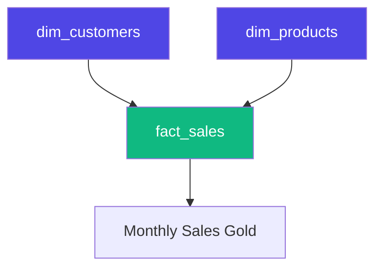

# Pipelines & Parallel Processing

Data engineering is rarely about a single file. It's about a **Network** of tables that depend on each other. LakeGuard helps you manage this network safely and quickly.

## 1. Managing Dependencies

In a Lakehouse, you often need to build your "Dimensions" (like Customers) before you can build your "Facts" (like Sales).

By using the `upstream` keyword, you tell LakeGuard about these connections.

```yaml
# fact_sales.yaml
info:
  title: Sales Fact
  
upstream: 
  - dim_customers
  - dim_products
```

### The LakeGuard DAG
When you run a project, LakeGuard builds a **Directed Acyclic Graph (DAG)**. This ensures that:
1.  **Dimensions** are validated and updated first.
2.  **Facts** are only processed if their dimensions are ready.



## 2. Parallel Processing (Speed)

If two tables are independent (e.g., `dim_customers` and `dim_products`), LakeGuard can process them at the **same time**.

-   **Automatic Scaling**: LakeGuard uses a task scheduler to run independent contracts in parallel threads.
-   **Engine Parallelism**: Engines like **Polars** and **DuckDB** are already multi-threaded, so LakeGuard leverages your CPU to the max.

## 3. Integration with Orchestrators

While LakeGuard can manage small projects natively, it plays nicely with "Big" orchestrators:

-   **Airflow**: You can use the `LakeGuardOperator` to trigger a contract as a task.
-   **Prefect / Dagster**: Use LakeGuard as a "Task" within your existing flows. 

### Why this is better:
-   **Atomic Faults**: If `dim_customers` fails its quality check, LakeGuard will automatically **stop** the `fact_sales` job to prevent orphaned keys in your Gold layer.
-   **Consistent Logic**: The same "Customer" definition is used by every developer in the project.
