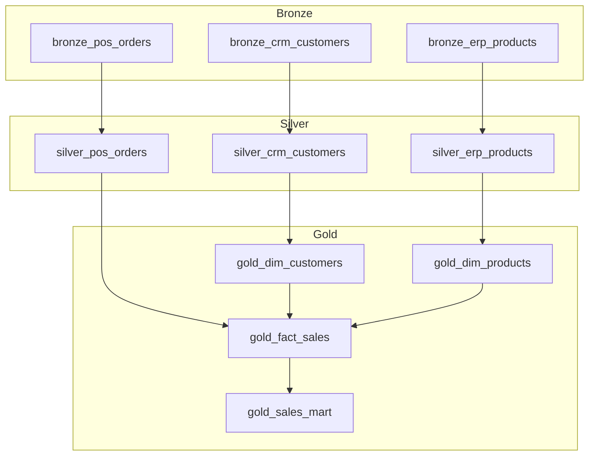

# Pipelines, Dependencies, and Parallelism

> Note: The OSS release focuses on contract execution. Use your orchestrator to schedule DAGs. The `upstream` field defines dependencies.

Data engineering is a network of tables. LakeGuard helps you define the network, while your orchestrator runs it safely.

## 1. Contract Registry (Source of Truth)

Store all contracts in a single registry so dependencies are discoverable.

Example structure:

```
contracts/
  bronze/
    bronze_crm_customers.yaml
    bronze_erp_products.yaml
    bronze_pos_orders.yaml
  silver/
    silver_crm_customers.yaml
    silver_erp_products.yaml
    silver_pos_orders.yaml
  gold/
    gold_dim_customers.yaml
    gold_dim_products.yaml
    gold_fact_sales.yaml
    gold_sales_mart.yaml
```

Each contract should declare a unique `dataset` and optional layer metadata:

```yaml
info:
  title: Silver Customers (CRM)
  target_layer: silver

dataset: silver_crm_customers
upstream:
  - bronze_crm_customers
```

## 2. Layered Pipeline Strategy (Bronze -> Silver -> Gold)

Recommended pattern:

- **Bronze**: raw ingestion, schema gate, quarantine bad rows.
- **Silver**: cleansed, standardized entities (layer_system_entity naming like `silver_crm_customers`, `silver_pos_orders`).
- **Gold**: shared dimensions/facts across systems (e.g., `gold_dim_customers`, `gold_fact_sales`), plus optional marts/aggregates.

Example dependency graph (explicit layers):



In practice, this lets you run all Bronze contracts in parallel, then all Silver entity cleanses in parallel, then Gold dimensions/facts, and finally Gold marts/aggregates.

## 3. Parallelism

- Orchestrators handle task-level parallelism.
- LakeGuard engines are multi-threaded by default (Polars and DuckDB) so each task is efficient.

## 4. Gating Rules (When to Block Downstream)

Common policy:

- **Block** downstream if dataset rules fail.
- **Block** downstream if quarantine ratio exceeds a threshold.
- **Continue** if only row-level quarantines exist and the threshold is acceptable.

Use the run log table to enforce this logic in your orchestrator.

## 5. Example Orchestrator Flow (Pseudo)

```text
registry = load_all_contracts("contracts/")
DAG = build_dag_from_upstream(registry)

for node in topo_sort(DAG):
    report = run_contract(node)
    if report.dataset_rules_failed:
        stop_downstream(node)
```

You can implement this flow in Airflow, Dagster, Prefect, or any workflow engine you already use.
