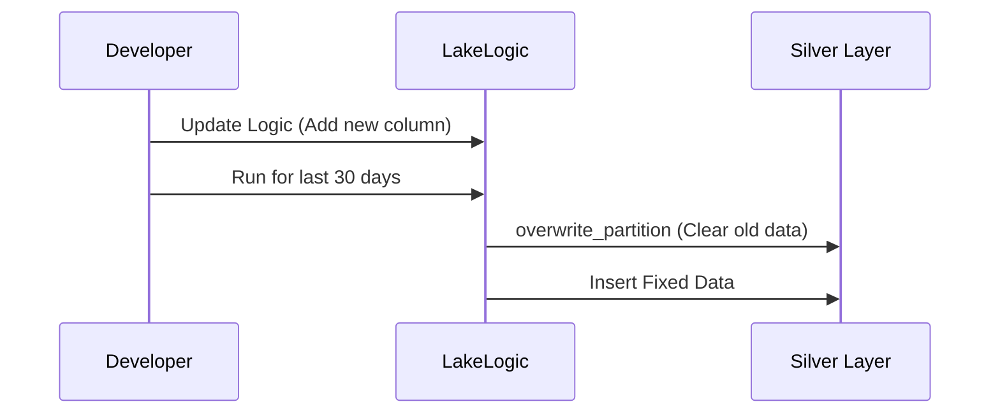

# Reprocessing & Partitioning

> Note: The OSS release supports local materialization, Spark table writes, and table-only warehouse adapters. File staging into warehouses is not included.

In a professional Data Lakehouse, you don't just "upload" data. You need a way to handle **Late Arriving Data** and **Reprocessing** without creating a mess.

LakeLogic makes your pipelines **Idempotent** (meaning you can run them multiple times safely).

## 1. Partitioning

Partitioning is like putting your data into folders by date. This makes it much faster to read and easier to manage.

```yaml
materialization:
  strategy: append
  partition_by: ["event_date"]
  reprocess_policy: overwrite_partition
  target_path: output/silver_pos_sales_events
  format: csv  # use delta/iceberg with Spark
```

When LakeLogic runs with this config, it ensures data is written to the correct "folder" (`event_date=2024-01-01`).

## 2. Handling Late Arriving Data

What if a sale from **yesterday** arrives **today**?

If you use `strategy: merge`, LakeLogic doesn't care when the data arrives. It will:
1. Look for the `primary_key` (e.g., `order_id`).
2. If it exists: Update the old record.
3. If it's new: Insert the new record.

This ensures your reports are always accurate, even if the internet was slow yesterday.

## 3. Reprocessing (The "Delete & Re-run" Pattern)

Sometimes you find a bug in your logic and need to fix data from the last 30 days.



By using `reprocess_policy: overwrite_partition`, LakeLogic handles the "Clean up" step for you. It deletes the data for the specific day you are running and replaces it with the new, fixed data.

If you want an extra safety guard, use `reprocess_policy: overwrite_partition_safe`. This writes the new partition to a temporary folder first and only swaps it into place after the write succeeds.

### Key Benefits:
- **No Duplicates**: Running the same job twice won't double your sales numbers.
- **Safety**: LakeLogic won't "Overwrite" your whole table by accident; it only touches the partitions it needs.
- **Speed**: By using `partition_by`, the engine only reads the data it needs to work on.

## 4. Quarantine Reprocessing Strategy

Quarantine is best treated as an **audit trail**. When corrected data arrives, re-run the contract against the corrected batch and write the fixed records into the target table using a safe reprocessing policy.

### Recommended Patterns

**A) Partition overwrite (batch corrections)**

```yaml
materialization:
  strategy: append
  partition_by: ["event_date"]
  reprocess_policy: overwrite_partition_safe
  target_path: s3://lake/silver/pos_sales_events
  format: parquet
```

Re-running the corrected batch will replace only the affected partition.

**B) Merge by primary key (dimension corrections)**

```yaml
primary_key: ["customer_id"]
materialization:
  strategy: merge
  target_path: s3://lake/silver/crm_customers
  format: parquet
```

This updates existing rows and inserts new ones without duplicating data.

### Quarantine as a Table (Lakehouse)

You can store quarantine rows in a table and keep it as an immutable audit log.

```yaml
quarantine:
  target: "table:main.silver.quarantine_pos_sales_events"
metadata:
  quarantine_table_backend: spark
  quarantine_table_format: iceberg
```

If you want to track which rows were reprocessed, enable lineage and update your quarantine table using the run id.

```yaml
lineage:
  enabled: true
```

Then mark the rows in a follow-up SQL step (example for Spark):

```sql
UPDATE main.silver.quarantine_pos_sales_events
SET quarantine_reprocessed = true
WHERE _lakelogic_run_id = '<run_id_from_reprocess>';
```
