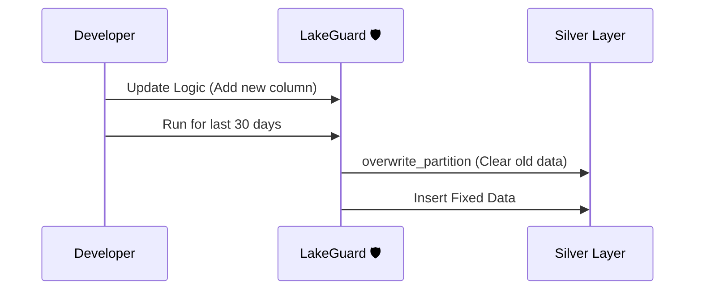

# Reprocessing & Partitioning

> Note: Materialization and reprocessing policies are on the roadmap. The OSS release focuses on validation, transformations, and quarantine.

In a professional Data Lakehouse, you don't just "upload" data. You need a way to handle **Late Arriving Data** and **Reprocessing** without creating a mess. 

LakeGuard makes your pipelines **Idempotent** (meaning you can run them multiple times safely).

## 1. Partitioning

Partitioning is like putting your data into folders by date. This makes it much faster to read and easier to manage.

```yaml
materialization:
  strategy: append
  partition_by: ["event_date"]
```

When LakeGuard runs with this config, it ensures data is written to the correct "folder" (`event_date=2024-01-01`).

## 2. Handling Late Arriving Data

What if a sale from **yesterday** arrives **today**? 

If you use `strategy: merge`, LakeGuard doesn't care when the data arrives. It will:
1. Look for the `primary_key` (e.g., `order_id`).
2. If it exists: Update the old record.
3. If it's new: Insert the new record.

This ensures your reports are always accurate, even if the internet was slow yesterday.

## 3. Reprocessing (The "Delete & Re-run" Pattern)

Sometimes you find a bug in your logic and need to fix data from the last 30 days.



By using `reprocess_policy: overwrite_partition`, LakeGuard handles the "Clean up" step for you. It safely deletes the data for the specific day you are running and replaces it with the new, fixed data.

### Key Benefits:
- **No Duplicates**: Running the same job twice won't double your sales numbers.
- **Safety**: LakeGuard won't "Overwrite" your whole table by accident—it only touches the partitions it needs.
- **Speed**: By using `partition_by`, the engine only reads the data it needs to work on.
