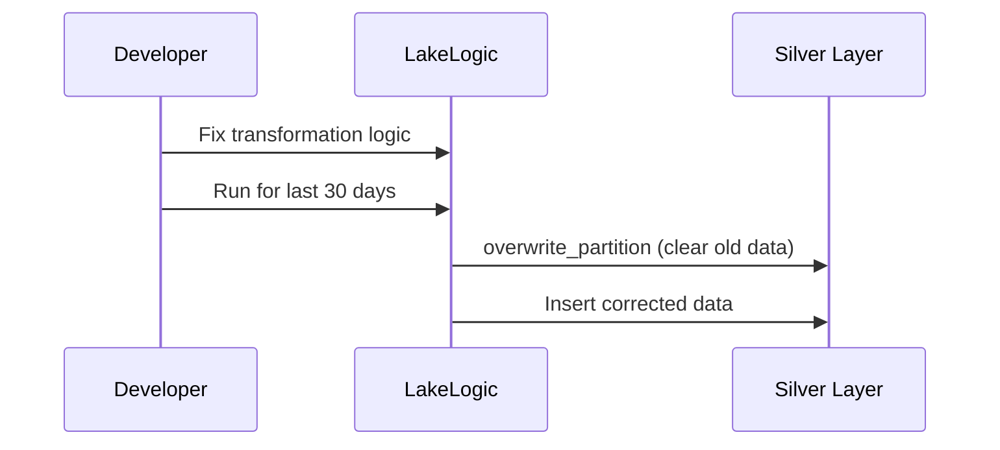

# Reprocessing & Partitioning

> **Think of partitioning like organizing a filing cabinet by month.**
> When you need to fix January's data, you pull out the January folder and replace it — you don't dump the entire cabinet and start over.

In a professional data platform, you need to handle late-arriving data and reprocessing without creating duplicates or corrupting your tables. LakeLogic makes your pipelines **idempotent** — run them twice, get the same result.

---

## Partitioning

Partitioning splits your data into logical folders (typically by date), making reads faster and rewrites surgical:

```yaml
materialization:
  strategy: append
  partition_by: ["event_date"]
  reprocess_policy: overwrite_partition
  target_path: output/silver_pos_sales_events
  format: parquet
```

**Why this matters:** When you query "show me last week's sales," the engine only reads 7 partition folders instead of scanning the entire table. At scale, this is the difference between a 2-second query and a 20-minute one.

### Graceful Partition Pruning (Centralized Partitioning)

In a professional data mesh, you typically centralize your partitioning strategy in `_system.yaml` so you don't have to repeat it across every contract:

```yaml
# _system.yaml
materialization:
  bronze:
    strategy: append
    partition_by: ["tenant_id", "event_date"]
```

However, not all tables have a `tenant_id`. LakeLogic handles this via **Graceful Partition Pruning**.
If a table only has `event_date`, LakeLogic will log a warning and automatically prune the missing `tenant_id` from the strategy:

```log
WARNING | Partition columns not present in data (pruned): tenant_id. This is expected when _system.yaml defines a superset of partition columns shared across multiple contracts.
```

The table will successfully write, partitioned solely by `event_date`. This allows you to define a "superset" partitioning strategy at the system level and let individual contracts naturally downgrade to what their data model supports.

---

## Handling Late-Arriving Data

> **Think of this like a late flight landing.**
> The airport doesn't rebuild the entire arrivals board — it just updates the one row that changed.

What if yesterday's sale arrives today? With `strategy: merge`, LakeLogic handles it automatically:

1. Look for the `primary_key` (e.g., `order_id`)
2. If it exists → update the old record
3. If it's new → insert it

```yaml
materialization:
  strategy: merge
  primary_key: [order_id]
  target_path: output/silver_orders
  format: parquet
```

**Why this matters:** Your reports stay accurate regardless of when data arrives. No duplicates, no missed records.

---

## Reprocessing (The "Fix and Replay" Pattern)

Sometimes you find a bug in your logic and need to fix the last 30 days of data:



With `reprocess_policy: overwrite_partition`, LakeLogic deletes only the affected partitions and replaces them with corrected data.

For extra safety, use `overwrite_partition_safe` — this writes to a temp folder first and swaps in only after success.

| Guarantee | How it helps |
| :--- | :--- |
| **No duplicates** | Running the same job twice won't double your sales numbers |
| **Surgical precision** | Only the affected partitions are touched |
| **Safe rollback** | `_safe` variant writes to temp first, swaps atomically |

---

## Date-Range Reprocessing (Backfills)

Need to reprocess a specific window? Tell LakeLogic the date range:

```yaml
materialization:
  strategy: append
  partition_by: ["event_date"]
  reprocess_policy: overwrite_partition
  target_path: output/silver_pos_sales_events
  format: parquet
```

```python
from lakelogic import DataProcessor

processor = DataProcessor(
    contract="contracts/silver_pos_sales_events.yaml",
    engine="polars",
)

# Reprocess just these 2 weeks
result = processor.run_source(
    reprocess_from="2026-01-15",
    reprocess_to="2026-02-01",
)
```

**What happens under the hood:**

1. Loads source data (bypasses incremental watermark)
2. Filters to rows within the date range
3. Validates against the contract
4. Overwrites only the affected partitions

| Scenario | Behaviour |
| :--- | :--- |
| `reprocess_from` only | Filters rows >= that date |
| `reprocess_to` only | Filters rows ≤ that date |
| Both set | Closed date range |
| Neither set | Normal incremental run |

---

## Quarantine Reprocessing

Quarantine is best treated as an **audit trail**. When corrected data arrives, re-run the contract against the corrected batch:

**Partition overwrite (batch corrections):**

```yaml
materialization:
  strategy: append
  partition_by: ["event_date"]
  reprocess_policy: overwrite_partition_safe
  target_path: output/silver_pos_sales_events
  format: parquet
```

**Merge by primary key (dimension corrections):**

```yaml
materialization:
  strategy: merge
  primary_key: [customer_id]
  target_path: output/silver_crm_customers
  format: parquet
```

**Why this matters:** Corrected data flows through the same quality gate as new data — no backdoors, no shortcuts around your rules.

---

## What's Next?

- **[Pipelines & Parallelism](pipelines.md)** — Orchestrating multi-table workflows
- **[How it Works](concepts.md)** — Deep dive into transformations and validation
