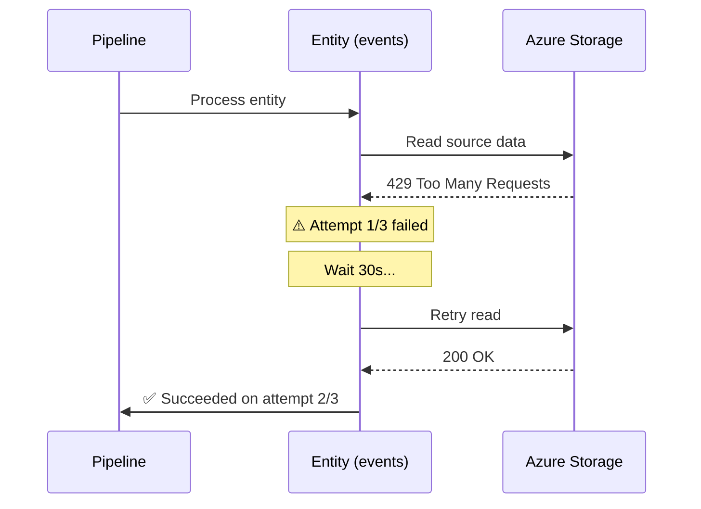
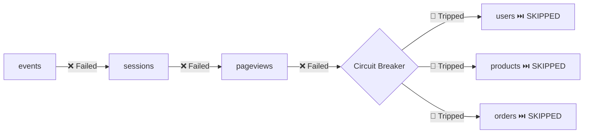
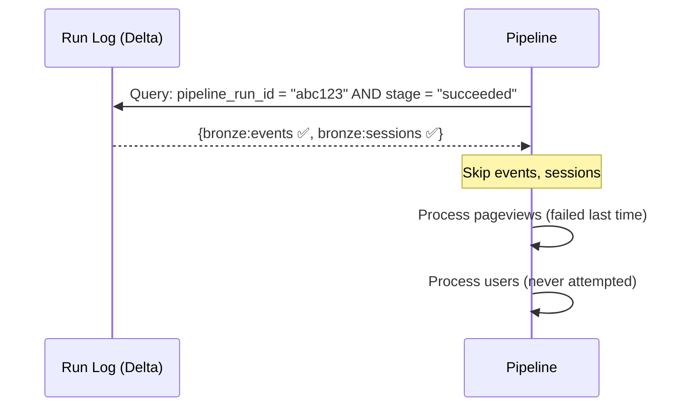
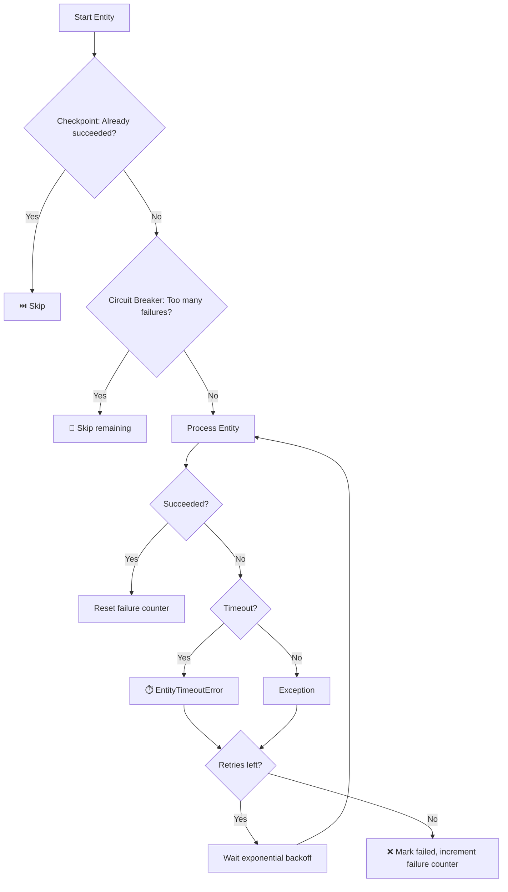

# Pipeline Resilience

> **Think of a data pipeline like a commercial flight.**
> A well-engineered plane doesn't crash because of one engine hiccup — it retries the ignition, alerts the crew, and if things get really bad, safely diverts to the nearest airport. Your data pipeline should work the same way.

Production data pipelines face transient failures daily — cloud storage throttling, network timeouts, credential expiries, and service outages. LakeLogic builds resilience directly into `pipeline.run()` so your pipelines **recover automatically** without custom orchestration code.

---

## Feature Overview

| Feature | What it does | Analogy |
| :--- | :--- | :--- |
| **Retry** | Re-attempts failed entities with exponential backoff | *A delivery driver tries a second time if nobody answers the door* |
| **Timeout** | Kills entities that run longer than expected | *A chef pulls a burnt dish off the stove instead of waiting forever* |
| **Circuit Breaker** | Stops trying when infrastructure is clearly down | *A fire alarm evacuates the building instead of checking each room* |
| **Checkpointing** | Resumes from where a previous run left off | *A bookmark lets you continue reading instead of starting from page 1* |

All four features are **opt-in with sensible defaults** — existing pipelines see zero behaviour change.

### A "Best-Effort" Philosophy

LakeLogic's pipeline runner is designed specifically as a **"best-effort" wave mechanism**. This means that entity processing continues independent of individual timeouts or errors.

If `table_a` hits an unexpected extraction error or exhausts its `entity_timeout_minutes`, the runner safely catches the exception, registers a failure in the run summary, and immediately moves to the next contract in the queue (`table_b`). The pipeline only stops entirely if you explicitly trip the infrastructure Circuit Breaker.

---

## Retry with Exponential Backoff

> **Business value:** A single Azure 429 (throttling) error on one entity no longer fails your entire pipeline run. The entity retries automatically while the rest of the pipeline continues.

```python
pipeline.run(
    layers="bronze,silver",
    retry_attempts=3,  # Try each entity up to 3 times
    retry_base_wait_seconds=30,  # 30s → 60s → 120s between attempts
)
```

### How It Works



### What You See in Logs

```log
⚠️ Attempt 1/3 failed for events (OSError): 429 Too Many Requests. Retrying in 30s...
  Traceback (most recent call last):
    File "runner.py", line 1325, in _process_single_contract
      ...
  OSError: 429 Too Many Requests

✅ events succeeded on attempt 2/3
```

Every failed attempt logs the **full exception type, message, and traceback**. Nothing is hidden or wrapped — unlike some retry libraries that obscure the original error behind a generic `RetryError`.

### Key Design Decisions

| Decision | Rationale |
| :--- | :--- |
| Per-entity, not per-pipeline | Only failed entities retry. Succeeded entities don't re-run. |
| Exponential backoff | Azure throttling penalises fixed-interval retries. Doubling the wait each time gives the service time to recover. |
| Default `retry_attempts=1` | Backward compatible. Existing pipelines are unaffected. |
| No external dependency | Pure stdlib — zero additional packages required. |

---

## Entity Timeout

> **Business value:** A single runaway Spark query scanning terabytes of unpartitioned data can block your entire pipeline for hours. Timeouts ensure no single entity holds the pipeline hostage.

```python
pipeline.run(
    layers="bronze,silver",
    entity_timeout_minutes=10,  # 10 minutes per entity
)
```

### Retry Sequence

Each entity runs inside a monitored thread. If it exceeds the timeout, LakeLogic raises an `EntityTimeoutError` — which then triggers the retry mechanism if configured:

```python
# Combined: timeout + retry
pipeline.run(
    layers="bronze,silver",
    entity_timeout_minutes=10,  # 10 min per entity attempt
    retry_attempts=2,  # Retry once if timed out
    retry_base_wait_seconds=60,
)
```

### Timeout Recommendations

| Scenario | Recommended timeout |
| :--- | :--- |
| Bronze (file ingestion) | 300–600s (5–10 min) |
| Silver (transformations) | 600–1800s (10–30 min) |
| Gold (aggregations/SCD2) | 1200–3600s (20–60 min) |
| Development / testing | 120s (2 min) — fail fast |

!!! tip
    Start with generous timeouts and tighten them as you learn your pipeline's normal execution profile. The run log captures execution duration per entity, giving you the data to set informed thresholds.

---

## Circuit Breaker

> **Business value:** When Azure Storage is completely down, a 50-entity data mesh pipeline without a circuit breaker would spend **50 × 3 retries × 2 min backoff = 5 hours** discovering what you already know after the third failure: *the infrastructure is down*.

```python
pipeline.run(
    layers="bronze,silver,gold",
    retry_attempts=3,
    retry_base_wait_seconds=30,
    max_consecutive_failures=3,  # Stop after 3 entities fail in a row
)
```

### Circuit Breaker Flow



The failure counter **resets to zero on any success**. So if `events` fails but `sessions` succeeds, the counter goes back to 0. The circuit breaker only trips on *consecutive* failures — indicating a systemic infrastructure problem, not an entity-specific bug.

### Circuit Breaker Log Output

```log
❌ All 3 attempts exhausted for events (OSError): 403 Forbidden
❌ All 3 attempts exhausted for sessions (OSError): 403 Forbidden
❌ All 3 attempts exhausted for pageviews (OSError): 403 Forbidden
🔴 Circuit breaker tripped: 3 consecutive failures. Skipping remaining entities to avoid wasted retries.
```

### Data Mesh Scale

In a data mesh with multiple domains, the circuit breaker becomes essential:

| Domain | Entities | Without circuit breaker | With circuit breaker (3) |
| :--- | :--- | :--- | :--- |
| Marketing | 4 | 4 × 3 retries = 12 attempts | 3 attempts → abort |
| Sales | 8 | 8 × 3 retries = 24 attempts | 3 attempts → abort |
| Finance | 12 | 12 × 3 retries = 36 attempts | 3 attempts → abort |
| **Total wasted time** | | **~72 retry cycles** | **~9 retry cycles** |

---

## Checkpointing (Resume from Failed Run)

> **Business value:** A 49-entity pipeline fails on entity #25 after 45 minutes of processing. Without checkpointing, you re-run the entire pipeline — wasting 45 minutes re-processing 24 entities that already succeeded. With checkpointing, you resume from entity #25.

```python
# First run fails partway through
summary = pipeline.run(layers="bronze,silver")
# summary.run_id = "abc123-def456-..."

# Resume from where it failed — skip already-succeeded entities
summary = pipeline.run(
    layers="bronze,silver",
    resume_from_run="abc123-def456-...",
)
```

### Checkpoint Sequence



1. The pipeline queries the **run log** for entities that succeeded in the previous run
2. Builds a set of `"layer:entity"` keys (e.g., `"bronze:events"`)
3. Skips any entity that already has `stage=succeeded` for that run
4. Processes only failed and never-attempted entities

### Checkpoint Log Output

```log
🔄 Resuming from run abc123-def456: skipping 2 already-succeeded entities (bronze:events, bronze:sessions)
  ⏭️ Skipping events [bronze] — already succeeded in run abc123-def456
  ⏭️ Skipping sessions [bronze] — already succeeded in run abc123-def456
  📄 [bronze] pageviews | Contract: Google Analytics Pageviews v1.0
  ✅ Materialized 1,200 rows for pageviews
```

### Why This Is Safe

| Layer | On re-run without checkpoint | Risk |
| :--- | :--- | :--- |
| **Bronze** (append) | Re-appends same data → duplicates | Low risk — duplicates are by-design audit signal |
| **Silver** (merge) | Re-merges → idempotent (same result) | No risk — merge deduplicates by primary key |
| **Gold** (overwrite) | Re-computes → idempotent | No risk — last write wins |

Checkpointing is a **time optimisation**, not a correctness requirement. LakeLogic's medallion architecture is inherently idempotent — but skipping 24 already-succeeded entities saves real compute cost and wall-clock time.

---

## Combining All Four

For production data mesh pipelines, use all four together:

```python
pipeline.run(
    layers="bronze,silver,gold",
    # Retry: recover from transient failures
    retry_attempts=3,
    retry_base_wait_seconds=30,
    # Timeout: prevent runaway entities
    entity_timeout_minutes=10,
    # Circuit breaker: fast-fail on infrastructure outage
    max_consecutive_failures=3,
    # Checkpoint: resume from last failure
    resume_from_run=last_failed_run_id,  # or None for fresh run
)
```

### Execution Flow



---

## Reusable Retry Utility

The retry logic is available as a standalone utility for any part of your codebase — not just pipeline runs:

```python
from lakelogic.core.retry import retry_call, with_retry

# Functional style — wrap any call
result = retry_call(
    requests.get,
    args=("https://api.example.com/data",),
    attempts=3,
    base_wait_seconds=10,
    retry_on=(ConnectionError, TimeoutError),  # Only retry these
    label="API fetch",
)


# Decorator style
@with_retry(attempts=3, base_wait_seconds=5)
def upload_to_storage(data, path): ...
```

---

## Parameter Reference

| Parameter | Type | Default | Description |
| :--- | :--- | :--- | :--- |
| `retry_attempts` | `int` | `1` (no retry) | Max attempts per entity. Set to 3 for production. |
| `retry_base_wait_seconds` | `int` | `30` | Base wait between retries. Doubles each attempt: 30s → 60s → 120s. |
| `entity_timeout_minutes` | `int` | `None` (no limit) | Timeout per entity attempt. Raises `EntityTimeoutError`. |
| `max_consecutive_failures` | `int` | `0` (disabled) | Circuit breaker threshold. Skips remaining entities after N consecutive failures. |
| `resume_from_run` | `str` | `None` (disabled) | Pipeline run ID to resume from. Skips already-succeeded entities. |

---

## What's Next?

- **[Observability](observability.md)** — Run logs, SLO validation, and alerting
- **[Reprocessing](reprocessing.md)** — Backfills, partition overwrites, and idempotent replays
- **[Pipelines & Parallelism](pipelines.md)** — Multi-entity orchestration and dependency waves
